# デベロッパーマニュアル

この章ではハードウェア設計者、ソフトウェア開発者向けの情報を記載します。
DigitShowModbusのビルド方法や、専用のModbusRTUボードについて、装置開発に必要な情報が含まれています。

## 目次
- [起動時変数](#起動時変数)
- [VisualStudio 2022 環境構築](#visualstudio-2022-環境構築)
- [コントロールの追加・修正](#コントロールの追加修正)
- [Modbusボードについて](#modbusボードについて)
- [各ICの性能と説明](#各icの性能と説明)
- [Webサーバー機能（開発者向け）](#webサーバー機能開発者向け)

## 起動時変数

### ModbusRTU AD/DA Board

2つの起動引数が存在します。
通信方法が"USBシリアル変換IC"か、"USB CDC-ACMによるマイコンとのダイレクト通信"かの選択が１つめ。
AnalogInputのInputRegisterが "int16_t" か、"float32_t" かの選択が２つめです。

USB CDC-ACMによるダイレクト通信での高速ポーリング処理の有効化には
完全表記が`--usb_cdc_direct=`、短縮表記が`-ucd=`です。
"True"もしくは"true"、"1"を指定することで高速ポーリングが有効になります。

InputRegisterの精度をfloat32_t（FloatInputRegister）にすると、
int16_t で通信されるデータに、小数点以下の値を拡張する形で通信されます。
その為、キャリブレーションなどに影響はありません。
完全表記が`--float_intput_reg=`、短縮表記が`-fir=`です。
"True"もしくは"true"、"1"を指定することでInputRegisterの精度がfloat32_tになります。

大まかな動作の違いを以下に示します。

*表: 各ボードの機能概要*

| BoardName | AD | DA | USB-Direct | FloatInput | Other |
| ---: | :--- | ---: | ---: | ---: | ---: |
| Trio（v1） | 16 | 6 | False | False | |
| Quartet（v2） | 16 | 8 | False | False | |
| Yamanin（v3） | 16 | 8 | True | True | |
| Milia（v4） | 16 | 8 | True | True | |
| Modulo（v5） | 16 | 8 | True | False | |

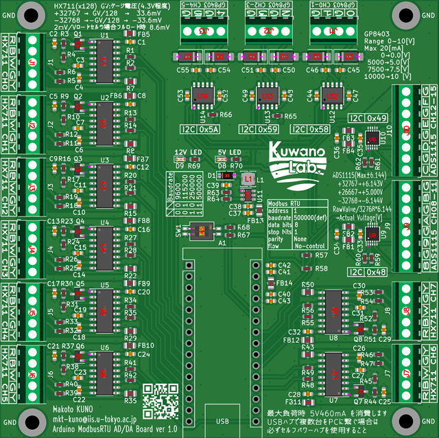

*図: Trio（v1）ボード*

ボードは緑で、上部DA出力コネクタが3個（6ch）なのが特徴です。

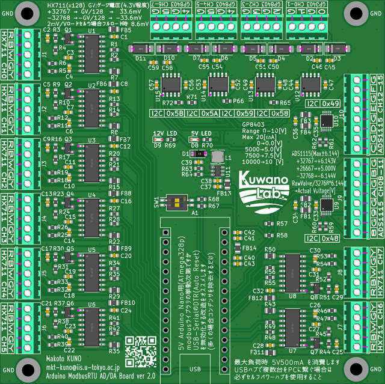

*図: Quartet（v2）ボード*

ボードは緑で、上部DA出力コネクタが4個（8ch）なのが特徴です。

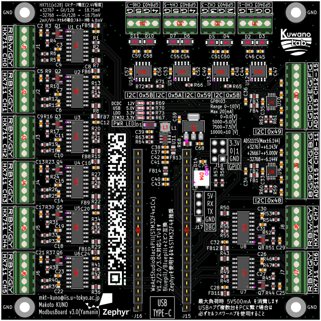

*図: Yamanin（v3）ボード*

ボードが黒く、Zephyrのロゴが入っており、NeoPixel LEDが搭載されていること、DA出力の付近の素子が小型化されていることが特徴です。

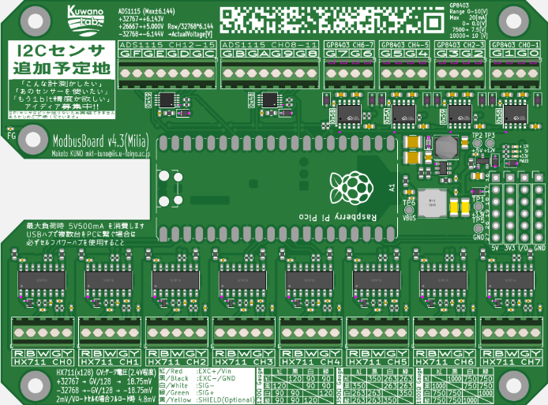

*図: Milia（v4）ボード*

ボードが正方形でなくなり、下側にHX711、上側にその他I/Oがまとめられていることが特徴です。

### ModbusRTU COM Port
完全表記が`--port=`、短縮表記が`-p=`です。

ModbusRTUボードとの通信に使用するCOMポートを指定するための引数です。
`--port=COM10`や`-p=COM6`のように指定します。
Trio（v1）・Quartet（v2）では、製造時期や互換ボードかどうかによって、FT232やCH340など、何かしらのUSBシリアル変換ICを使用しているため、デバイスマネージャー等で確認しましょう。
また、動作際してはドライバが必要になります。
ArduinoIDEをインストールするか、多くの場合WindowsUpdateのAdditional Updateでドライバがインストール可能です。
Yamanin（v3）では、USB-CDC（ACM）を使用した高速・高信頼のシリアル通信を採用しており、基本的にWindows標準のドライバが利用可能なため、追加のドライバインストールは不要です。


*図: COMポートの例*

### ModbusRTU Baudrate
完全表記が`--baudrate=`、短縮表記が`-b=`です。
ModbusRTUボードとの通信速度を指定するための引数です。基本的に設定する必要はありません。
Trio・Quartet・YamaninではないオリジナルのModbusボードを使用する際に利用してください。

### フォント
完全表記が`--font=`、短縮表記が`-f=`です。
フォントの指定は、`--font="MS Gothic"` `--font="Source Han Code JP"`のように指定します。
デフォルトは"Lucida Sans Typewriter"ですが、他のフォントを指定することも可能です。
見やすさもありますが、Windowsの環境によっては存在しないフォントを使用しようと、アプリケーションが試行する可能性がありますので、環境ごとに確認してください。

### 動作モード
完全表記が`--mode=`、短縮表記が`-m=`です。

"0"もしくは"motor"を指定することで生研式モータ動作モードで起動します。

"1"もしくは"torsional"を指定することで生研式ねじり試験動作モードで起動します。

基本的にMotor動作モードで起動することをお勧めします。ねじりモードは開発中です。
Debugビルドで試用して、安全性を確認してから長期運用してください。

### クラッチ&モータ動作電圧
完全表記が`--invert_motor_enable=`、短縮表記が`-ime=`です。

完全表記が`--invert_motor_direction=`、短縮表記が`-imd=`です。

"True"もしくは"true"、"1"を指定することで極性が反転します。
デフォルト状態はソースコードの確認をしてください。大きな変更が加わっていない限りは，
"モータON"が"5.0 [V]"、"モータOFF"が"0.0 [V]"。
同じように"モータUP"が"5.0 [V]"、"モータDOWN"が"0.0 [V]"です。
コードを検索する場合は下記のような記述を探してください。

**CDigitShowModbus.cpp より抜粋**

```cpp
#define DSM_AO_DEF_VLT_MOTOR_ON (5.0f)			// Voltage of Axial Motor ON
#define DSM_AO_DEF_VLT_MOTOR_OFF (0.0f)			// Voltage of Axial Motor OFF
#define DSM_AO_DEF_VLT_MOTOR_UP (5.0f)			// Voltage of Axial Motor UP
#define DSM_AO_DEF_VLT_MOTOR_DOWN (0.0f)		// Voltage of Axial Motor DOWN
```

### Webサーバー機能
完全表記が`--listen=`、短縮表記が`-l=`です。
Webサーバー機能を有効にするための引数です。
有効化された場合、実行ファイルと同一ディレクトリにある`www`フォルダ内のファイルをルートとして提供します。
引数では公開範囲とポートを指定します。
例として、そのパソコンからのみアクセス可能で、通常のHTTPポート80で公開する場合は、`--listen="localhost:80"`と指定します。
他のパソコンからもポート80をアクセス可能にする場合は、`--listen="0.0.0.0:80"`と指定します。

## VisualStudio 2022 環境構築
Visual Studio 2022 でのビルド方法を記載しています。2025年移行のバージョンについては、Googleで情報を検索し、逐次正しいビルド依存関係を選択してください。

### VisualStudio 2022のインストール
MicrosoftからCommunity 2022 のインストーラを取得し実行します。無料版（Community）の最新版をネットから確実にダウンロードしてください。


*図: Microsoft公式ホームページ*

### 必要なコンポーネントのインストール
まず、"ワークロード"から"C++によるデスクトップ開発"を選択する。
ここでそのままインストールしないこと。"個別のコンポーネント"より、追加のパッケージのインストールが必須です。Linux向け`C++`や`C#`など似た表記が多いので注意すること。

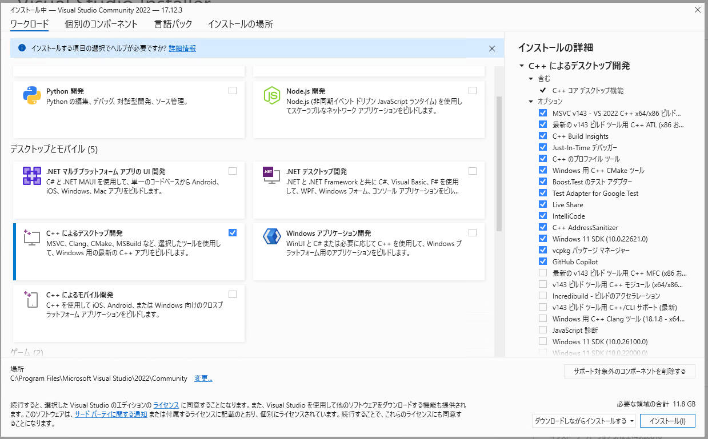

*図: ワークロード選択画面*

次に"個別のコンポーネント"より"Windows 11 SDK"の最新版を追加します。
検索欄に"Windows 11 SDK"と入力すると探しやすくて良いでしょう。
探した結果、すでに選択されている場合は、最新のものを2つ選択するようにしてください。

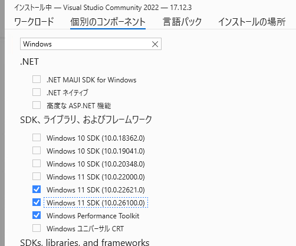

*図: Windows 11 SDKの最新版の選択*

次に最新のMFC用ビルドツールを追加します。
検索欄に"C++ MFC"と入力すると探しやすくて良いでしょう。
使用しているプラットフォームに合わせて（多くの場合"x86およびx64"）最新のC++ MFCビルドツールを選択してください。VisualStudio2022 であれば、 v143 になっているはずです。
Snapdragonが乗ったSurface向けにクロスコンパイルしたい場合などは、ARM64/ARM64ECなど、環境に応じたツールもインストールしてください。
基本的に"x86およびx64向け"を選択しておけば間違いないですが、まよったら画像のように全部入れてください。

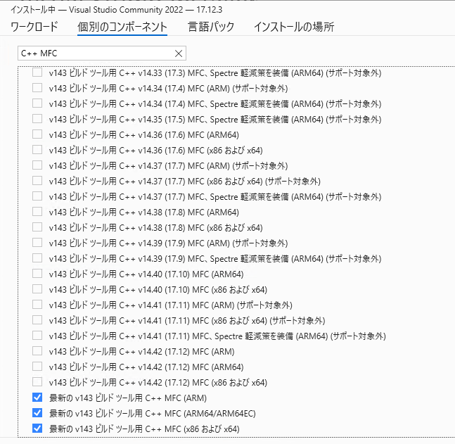

*図: プラットフォームの選択*

最終的に、１～５個程度の追加パッケージが選択されているのを確認し、インストールを開始します。

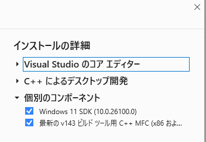

*図: 追加のコンポーネント一覧*

### ソースコードの取得
取得にはGitが必須です。最低限学習して、コミット、という単語の意味が分かるようにしてください。
また、submoduleも使用しているため、Gitコマンドラインでの取得を推奨します。
一発で行う場合は以下のように実行してください。

`git clone --recurse-submodules https://github.com/mkt-kuno/DigitShowModbus.git`

分割する場合や、更新があった場合などは

`git clone https://github.com/mkt-kuno/DigitShowModbus.git`

`git submodule update --init --recursive`

のように、分割して必要なコマンドを実行してください。詳しくはGitのドキュメントを参照してください。

### ソリューションのオープン
VisualStudioのインストールが完了したら、ソリューションファイルを開きます。いくつか方法がありますが、最も簡単なのはVisualStudioを起動した後に"プロジェクトやソリューションを開く"を選択し、"DigitShowModbus.sln"を選択することです。

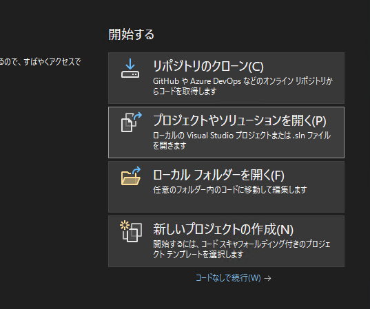

*図: VisualStudio起動時初期画面*

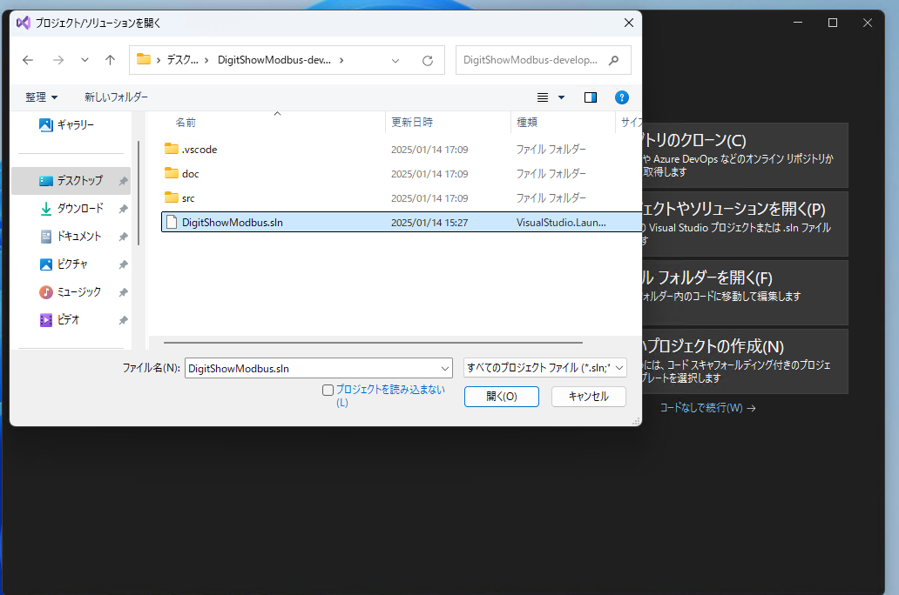

*図: .slnファイルの選択*

slnファイルのダブルクリックでも開けますが、VisualStudioが複数インストールされている場合は、複雑な挙動になる可能性があります。

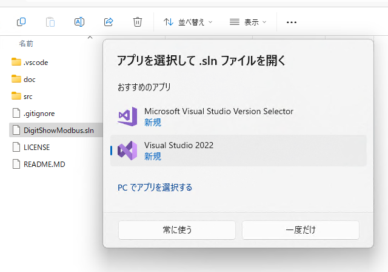

*図: 直接選択時の挙動の一例*

### ソリューションのビルド
コードの追加時や初回運用時などは "Debug"モードでビルドすることをお勧めします。逆にそれ以降では、ログが増えすぎることから"Release"モードでビルドすることをお勧めします。
ログの仕組みについては外部ライブラリを使用しているため"spdlog"のドキュメントを参照してください。
通常運用時は特別な理由がない限り "x64"の"Release"を選択しておけば間違いはありません。
"spdlog"にはログレベルがあり、優先度の低いものから"trace"、"debug"、"info"、"warn"、"error"、"critical"があります。
"Release"モードでは"info"以上が出力され、"Debug"モードでは"debug"以上が出力されます。
"trace"は非常に詳細なログを出力するため、通常は使用しません。

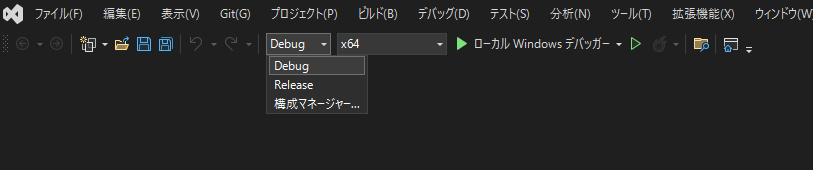

*図: ビルドモードの選択*

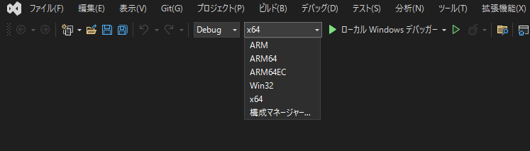

*図: プラットフォームの選択*

「なにもしてないのにビルドが通らなくなった」は、よくあることです。ソリューションの"リビルド"もしくは"クリーン"の後に"リビルド"してください。

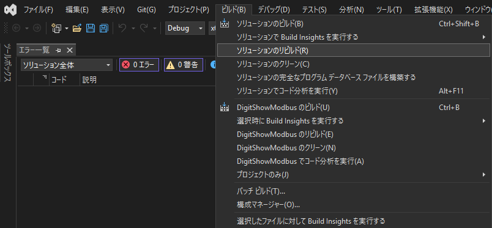

*図: ソリューションのリビルド*

## コントロールの追加・修正
`src/DigitShowModbusDoc.cpp` 及び `src/DigitShowModbusDoc.h` を起点として、`src/Control_xxxx.cpp`と`src/Control_xxxx.h`を編集します。
そもそもの前提知識として、自分にあった`C++`の教材で（なんでもいいです）、ポインタとクラスまで学んでおくことを強くお勧めします。
そこまでの知識がないと、何を書いて良いか分からなく可能性が非常に高いです。
Pythonの事前知識があればとっつきやすと思いますが、C++はPythonとは異なる部分が多いです。
正しくない記述に寄ってプログラムがクラッシュしたとしても、Pythonのようにエラー箇所がわかりやすく提示されません。

加えて、初心者レベルで良いので、Git習得を強く推奨します。Gitを使っていないと、コードのバックアップや、間違った修正を戻すことが非常に困難です。
Gitを使用していな場合、コードの変更点がわからなくなったプログラムを持って来ても、救いませんし、救えません。
上記の点に留意し、勉強したうえでコントロールを修正してください。

多くの人が修正を加えたいのは、`CDigitShowModbusDoc::ControlMain`での処理になると思います。
以下にIISモーターモードでの処理の例を示します。

IDが1（CONTROL_TYPE_PRECONSOLIDATION）の場合は、`Control_PreConsolidation`を呼び出します。これは見ての通り、"Control from File"からではない先行圧密用の関数です。

IDが15（CONTROL_TYPE_STEP）の場合は、`Control_FileCtrl_xxxxx`関数群を呼び出します。これがメイン機能の "Control from File"で実行されるプログラム群です。

本当に動いているか不安な場合は"Release"ビルドでもログの出る`spdlog::info`をどんどん追加して、ログを出力してください。

また、変なC/C++コードを追加すると、"Release"モードではコンパイラによる最適化され、コードが無視されたり、意図しない挙動になったります。
その結果"Debug"モードでは動くのに"Release"モードでは動かない、という事象が発生する可能性があります。
自分の書いたコードが不安なら"Debug"モードで動作させましょう。

**Control_Motor.cpp より抜粋**

```cpp
void Control_Motor::Main()
{
	spdlog::trace("{}", __FUNCTION__);

	auto ctx = GetCDSBContext();
	if (ctx->Flag.control == FALSE)
		return;

	nlohmann::json _for_spdlog;

	spdlog::debug("MOTOR_ControlMain Ctrl Type:{}", (int)ctx->Control.type.load());

	switch (ctx->Control.type)
	{
	case CONTROL_TYPE_NONE:
		break;
	case CONTROL_TYPE_PRECONSOLIDATION:
		Control_PreConsolidation();
		break;
	case CONTROL_TYPE_STEP:
	{
		auto ctrl_step = ctx->Control.current_step.load();
		auto ctrl_step_cc = ctx->Control.Step[ctrl_step].ctrl.load();
		auto ctrl_step_args = ctx->Control.Step[ctrl_step].args;
		_for_spdlog["current_step"] = ctrl_step;
		_for_spdlog["step_num"] = ctrl_step_cc;
		for (int i = 0; i < DSM_STEPCTRL_ARGS_MAX; i++)
		{
			_for_spdlog["args"][i] = ctrl_step_args[i].load();
		}
		spdlog::info("{}:{}", __FUNCTION__, _for_spdlog.dump());

		if (ctrl_step_cc == 0)
		{
			// No Control
			Set_Speed(0.0f); // RPM->0
		}
		if (ctrl_step_cc == 1)
			Control_Motor::Control_FileCtrl_MonotonicAxialLoading();
		if (ctrl_step_cc == 2)
			Control_Motor::Control_FileCtrl_CyclicAxialLoadingStress();
		if (ctrl_step_cc == 3)
			Control_Motor::Control_FileCtrl_CyclicAxialLoadingStrain();
		if (ctrl_step_cc == 4)
			Control_Motor::Control_FileCtrl_Creep();
		if (ctrl_step_cc == 5)
			Control_Motor::Control_FileCtrl_LinearStressPathLoading();
		break;
	}
	default:
		break;
	}
}
```

## Modbusボードについて

### 基本機能とピン配置
ボードには3種類のコネクタがあります。HX711-ひずみ入力用コネクタ、ADS1115-電圧入力用コネクタ、GP8403-電圧出力用コネクタです。


*図: HX711-ひずみ入力用コネクタの簡易説明*

歪入力は4線もしくはシールド線を含む5線で接続します。Vin、GND、SIG+、SIG-、SHIELDの5本です。
シールド線は必須ではありませんが、ノイズ対策として接続することをお勧めします。
またこれらの色は一般的なロードセルの配線色に合わせていますが、必ずしも**そうでない**場合があります。
**必ずテスターなどで抵抗値を測定し**、正しい配線を確認してください。
一般的な抵抗値テーブルを以下に示します。

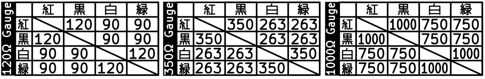

*図: ひずみゲージ抵抗値テーブル*

ADS1115は前述の通り、電源入力のコネクタです。1ブロックにつき4入力あります。
CH10から先は16進数表記で A（10）、B（11）、C（12）、D（13）...となります。
必ず入力信号側に赤色のケーブルを接続し、ターゲットデバイスのGNDと入力チャンネル横のGNDを接続してください。逆接続するとボード、もしくはターゲットデバイスが破損します。
GP8403は電圧出力用のコネクタです。1ブロックにつき2出力あります。
必ず出力信号側に赤色のケーブルを接続し、ターゲットデバイスのGNDと出力チャンネル横のGNDを接続してください。逆接続するとボード、もしくはターゲットデバイスが破損します。
Gは予約文字でGND接続を意味します。

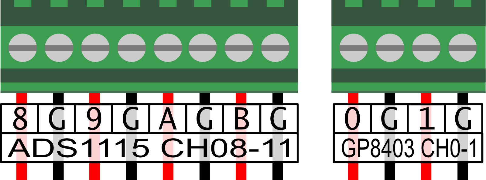

*図: その他コネクタの簡易説明*

### Modbus TCP/RTU/ASCII
Modbusとは、1979年にModicon（現在のSchneider Electric）が開発した通信プロトコルです。
Modbusは、RS-232CやRS-485などのシリアル通信を使用するModbus RTU/ASCIIと、TCP/IPを使用するModbus TCPの2つのバージョンがあります。
TCP/IPを使用するには全台がDHCP対応でオンラインなネットワークに属しているか、静的IPで設定されたクローズドネットワークに属している必要があります。
今日日、多くの大学、会社でネットワークの管理が厳しくなっているため、本プロジェクトでは物理接続で動作が可能なModbus RTU/ASCIIを選択しました。

次にRTUとASCIIとの違いですが、どちらも同じシリアル転送、をベースとした技術です。RTUはバイナリ形式で、ASCIIはテキスト形式で通信します。
要は人間が通信内容を見たときに分かるか（テキスト形式）どうか、という感じです。
RTUはバイナリ形式で通信するため、通信速度が速く、ASCIIはテキスト形式で通信するため、通信速度が遅いです。
本プロジェクトでは将来的に通信レートが向上することに対応するため、RTUを選択しました。

### シリアル通信
最近ではArduino、また多くの電子天秤や制御機器で"Serial"や"シリアル通信"、"UART"、"RS-232C"などの用語を見かけると思います。
厳密なことはおいておいて、これらの単語は同じ通信方式を指すと言っていいでしょう。
TX（送信）とRX（受信）これらの対によって、ホスト（Windowsなど）とデバイス（Arduinoなど）が通信を行います。
通信内容は基本的に文字列通信ですが、バイナリ通信も可能です。多くの場合文字列通信が使用されるというだけです。

ここでシリアル通信の種別について、RS-232C、RS-422、RS-485、USB-CDCなどがあります。

RS-232Cは古い規格で、シングルエンド通信のため最大通信速度が遅いですが、通信距離が長いです。
1対1の通信が可能で、通信線には最低限GND、TX+、RX+の3本が必要です。

RS-422はRS-232Cの改良版で、差動通信かつTX, RXが別れているため通信速度が速く、通信距離も長いです。
1対1の通信が可能で、通信線には最低限GND、TX+、TX-、RX+、RX-の5本が必要です。GNDを除いた4本て大丈夫な、絶縁通信もあります。

RS-485はRS-422の改良版で、差動通信でTX/RXをまとめた形のため、マルチポイント通信が可能です。
1対多の通信が可能で、通信線には最低限GND、D+、D-の3本が必要です。GNDを除いた2本て大丈夫な、絶縁通信もあります。

USB-CDCはシリアル通信を全部USBに乗せて通信するための規格です。USB-CDCはUSBのため、通信速度が速く、通信距離も長いです。
1対1の通信が可能で、通信線には最低限GND、D+、D-の4本が必要です。

例えばArduino Uno/Nanoでは、PCからArduinoボードに搭載されたFT232/CH340などのUSBシリアル変換ICまではUSB-CDCでUSB通信し、その後はFT232/CH340などのシリアル変換ICからRS-232Cでマイコンと通信を行います。
[後述するYamanin（v3）](#modbusボード-v3yamanin)ではPCからマイコンボードまで直接USBが通信線として使用されており、ロスや遅延、無駄な処理なくシリアル通信が行われます。

### シングルエンド信号と差動信号
このような、接続できる機器の数、伝送距離、伝送速度、ノイズ耐性、電源電圧などの要素を考慮して、通信方式を選択する際に出てくるワードが、シングルエンド信号と差動信号です。
シングルエンド信号は、信号線とGNDの間で信号を送る方式です。例えばArduino等の場合、5 Vで動作していれば、信号線が3 V以上でHIGH、1 V以下でLOWというように、GNDとの電圧差で信号を判断します。
これは同時に外部から瞬間的に3V程度のノイズが乗った際に、もしくはアースやグランドが不安定になると誤動作を起こす可能性があります。
なのでテレビのリモコンなんてのは、なんとなくのGNDで動作するシングルエンド信号で動作しているため、リモコンをテレビの前に持っていかないと反応しない、方向が悪いと反応しないということがあります。
他には液晶のD-SUBなんてのは、シングルエンド信号で動作している上、あろうことかアナログ信号なので、端子の刺さりが甘かったり、端子を触ってノイズが乗ると画面が大きく乱れることがあります。

差動信号は、信号線と信号線の間の電圧差で信号を送る方式です。例えばRS-485などの場合、TX+とTX-の間で信号を送ります。
例えばTX+（例：+2 V）とTX-（例：-2 V）電圧差が4 V以上ならHIGH、例えばTX+（例：-2 V）とTX-（例：+2 V）電圧差が-4 V以下ならLOWというように、信号線間の電圧差で信号を判断します。
これは先ほどと違い、外部からノイズが乗っても、信号線間の電圧差が変わらない限り、誤動作を起こしにくいです。
身の回りだと、有線LANやUSB、HDMI、DVIなどが差動信号で通信しています。有線LANは 4対の通信線。USB 1.0/2.0 は 2対の通信線です。USB 3.0 は高速化の更に通信対を足しています。
要は、高速・安定の通信をするには差動信号が良い、ということです。

### フィールドネットワーク
フィールドネットワークとは、工場や建物内の機器やセンサー、アクチュエーターなどを接続するためのネットワークです。
我々の用途も、砂・水・油・薬品を利用するため、フィールドネットワークを使用している、と言っていいでしょう。
フィールドネットワークには、Profibus、DeviceNet、EtherCAT、CC-Link、Modbus、CAN、PROFINET、EtherNet/IP、POWERLINK、Sercos、IO-Link、AS-Interface、HART、Bluetooth、Zigbee、Threadなどがあります。
あまりに多すぎますが、この殆どがライセンス絡みで有料で、ホスト側のデバイスも高価である場合が多いです。
この中で比較的安価に利用可能なのが、CAN、Modbus、Bluetoothあたりです。

CANは車載向けで多く使われてきた実績があり、車体全体のアースをGNDとすることで、1対の差動線のみで通信が可能で、一本の線が切れても通信が可能、加えて複数デバイスを接続することが可能です。
この技術は3Dプリンタにも応用され、多くのフラッグシップ3Dプリンタは、高速に動作させたいホットエンド部分につながる線を、通信速度と信頼性を保ったまま減らすため、CANを採用しています。
我々の用途の場合、CANの通信プロトコルが複雑であることと、1回あたりの通信（メッセージ）長が短い事が問題になります。

Bluetoothは無線のため、否が応でも予期しない遅延が、かつ電波環境依存で安定しない遅延時間が発生します。計測レートが1 sample/s程度ならば気になりませんが、高速計測を行う場合は、遅延が問題になるので、今回は考慮しませんでした。

残されたのがModbus、とくにRTUでした。Modbus RTUは、基本的にはRS-485を使用するため、差動信号で通信が行われ、信頼性が高いです。また、RS-485はマルチポイント通信が可能で、複数のデバイスを接続することが可能です。
しかし、RS485ではなくUSB-CDCを使用すれば、1対1通信の限定になりますが、高速通信を行うことが可能です。Arduinoなどをデバイスとするのであれば、ライブラリも多く存在し、仕様もオープンなため、開発がしやすいというメリットもあります。
またModbus TCPという上位規格があるため、物理接続がいよいよ廃れ始めた頃にTCP/IPへの以降もスムーズに進むと考えられます。
諸々の理由により、本プロジェクトではModbus RTUを採用しました。

### Modbusボード v1（Trio）/v2（Quartet）
- 開発コード：Trio（v1）/Quartet（v2）
- マイコン：Arduino Nano（ATmega328p）
- プラットフォーム：Arduino
- 通信方式：USBシリアル
- 通信プロトコル：Modbus RTU
- 通信速度：38400 bps
- 入力-HX711：1 ch/ic, 計8 ch, 16 bit精度, 128倍ゲイン,10 Hz動作
- 入力-ADS1115：4 ch/ic, 計16 ch, 16 bit精度, 64 Hz動作（オプションで128 Hz）
- 出力-GP8403：2 ch/ic, 計6/8 ch, 12 bit精度, オンデマンド動作

### Modbusボード v3（Yamanin）
- 開発コード：Yamanin（v3）
- マイコン：STM32F411CE（BlackPill）
- プラットフォーム：Zephyr RTOS
- 通信方式：USBシリアル
- 通信プロトコル：Modbus RTU
- 通信速度：38400 bps（USBダイレクトのため、何でも良い）
- 入力-HX711：1 ch/ic, 計8 ch, 16 bit精度, 128倍ゲイン, 80 Hz動作, 単純加算平均（8サンプル）
- 入力-ADS1115：4 ch/ic, 計16 ch, 16 bit精度, 128 Hz動作
- 出力-GP8403：2 ch/ic, 計8 ch, 12 bit精度, オンデマンド動作

### Modbusボード v4（Milia）
- 開発コード：Milia（v4）
- マイコン：Raspberry Pi Pico（RP2040）
- プラットフォーム：Arduino
- 通信方式：USBシリアル
- 通信プロトコル：Modbus RTU
- 通信速度：38400 bps（USBダイレクトのため、何でも良い）
- 入力-HX711：1 ch/ic, 計8 ch, 16 bit精度, 128倍ゲイン,10 Hz動作
- 入力-ADS1115：4 ch/ic, 計16 ch, 16 bit精度, 64 Hz動作（オプションで128 Hz）
- 出力-GP8403：2 ch/ic, 計6/8 ch, 12 bit精度, オンデマンド動作

## 各ICの性能と説明

### ひずみ入力IC：HX711
24 bit精度のADCを搭載した、内臓で128倍のゲインを持ち、10 Hzもしくは80 Hzのサンプリングレートを持った高精度なアナログデジタルコンバータです。
ゲージ電圧1〜5 V程度の、フルブリッジ式のひずみセンサーの接続に適しています。
出力される値は本来であれば、符号付き24 bit精度ですが、ノイズ等により実質的な性能が16 bit程度のため、本プロジェクトでは符号付き16 bit精度（int16_t/i16）として扱っています。

動作電圧が2.048 Vの場合の物理値と、ゲイン済み電圧、ゲイン前電圧、の関係を表すと以下の表のようになります。

*表: HX711の物理値と換算式*

| 物理値 | 物理値 | 差圧（128倍）[mV] | 差圧[mV] | 電圧[mV] | 出力（E=2）[mV/V] |
| ---: | ---: | ---: | ---: | ---: | ---: |
| 32767 | 0x7FFF | 2048 | 16 | 8 | 3.906 |
| 16384 | 0x4000 | 1024 | 8 | 4 | 1.953 |
| 8192 | 0x2000 | 512 | 4 | 2 | 0.977 |
| 4096 | 0x1000 | 256 | 2 | 1 | 0.488 |
| 2048 | 0x0800 | 128 | 1 | 0.5 | 0.244 |
| 0 | 0x0000 | 0 | 0 | 0 | 0 |
| -4096 | 0xF000 | -256 | -2 | -1 | -0.488 |
| -8192 | 0xE000 | -512 | -4 | -2 | -0.977 |
| -32768 | 0x8000 | -2048 | -16 | -8 | -3.906 |

HX711のint16_t（i16）物理値からmV/V、もしくはμεへの定格出力値への変換については、以下の式を使用してください。

$$
\begin{align}
    \Delta e            &= \frac{E}{4} K\varepsilon  & \left[\mathrm{V}\right] \\
    \varepsilon         &= \frac{4\Delta e}{KE} & \left[\varepsilon\right]\\
    \frac{\Delta e}{E}  &= \frac{\mathrm{Raw}_\mathrm{i16}}{\mathrm{INT16\_MAX} \times \mathrm{HX711\_GAIN} \times \mathrm{DIFF}}  & \\
                        &= \frac{\mathrm{Raw}_\mathrm{i16}}{32767 \times 128 \times 2} & \left[\mathrm{V}\right]  \\
    \mu\varepsilon      &= \frac{\mathrm{Raw}_\mathrm{i16}}{\mathrm{INT16\_MAX} \times \mathrm{HX711\_GAIN} \times \mathrm{DIFF}} \times K \times 1\mathrm{E}6 & \\
                        &= \frac{\mathrm{Raw}_\mathrm{i16}}{32767 \times 128 \times 2} \times 2.0 \times 1\mathrm{E}6 & \left[\mu\varepsilon\right]
\end{align}
$$

$$
\begin{align}
    \Delta e    &: \text{負荷時の出力電圧} & \left[\mathrm{V}\right] \\
    E           &: \text{印加電圧} & \left[\mathrm{V}\right]  \\
    K           &: \text{ゲージ率（殆どの場合2.0）} &   \\
    \varepsilon &: \text{ひずみ} & 
\end{align}
$$

### 汎用入力IC：ADS1115
シングルエンド入力と差動入力が可能な16 bit精度のADCを搭載した、I2C接続のアナログデジタルコンバータです。最大CHはシングルエンドジ4つで、差動入力で2つです。
入力電圧範囲は最大で-6.144〜+6.144 Vで、計測レートは8〜860 sample/sまで設定可能です。
計測レートを上げすぎると精度が下がり、計測レートを下げすぎるとチャンネル間の遅延が大きくなるため、使用される想定レートに合わせ、本プロジェクトでは7〜8 ms/1ch（32 ms/4 ch） 程度の計測レートで使用しています。

ADS1115ののint16_t（i16）物理値の換算表、換算式は以下の表のようになります。

*表: ADS1115の物理値と換算式*

| 物理値 | 物理値 | 電圧 |
| ---: | ---: | ---: |
| 32767 | 0x7FFF | 6.144 |
| 16384 | 0x4000 | 3.072 |
| 8192 | 0x2000 | 1.536 |
| 4096 | 0x1000 | 0.768 |
| 0 | 0x0000 | 0.000 |
| -4096 | 0xF000 | -0.768 |
| -8192 | 0xE000 | -1.536 |
| -32768 | 0x8000 | -6.144 |

$$
\begin{align}
    V   &= \frac{\mathrm{Raw}_\mathrm{i16}}{\mathrm{INT16\_MAX}} \times \mathrm{ADS1115\_RANGE} & \\
        &= \frac{\mathrm{Raw}_\mathrm{i16}}{32767} \times 6.114 & \left[\mathrm{V}\right]
\end{align}
$$

### 電圧出力IC： GP8403
12 bit精度のDACを搭載した、I2C接続のデジタルアナログコンバータです。最大CHは2つで、出力電圧範囲は0〜10.0 Vです。
このICのみ入出力の指定8bitの倍数にうまく収まらないため、DFRobot社のGP8403ライブラリ互換の出力値指定方法となっています。
具体的には、指定値がuint16_tの範囲を取り、mVオーダーで出力電圧を指定します。

GP8403のuint16_t（u16）物理値の換算表、換算式は以下の表のようになります。

*表: GP8403の物理値と換算式*

| 物理値 | 物理値 | 出力電圧[mV] | 出力電圧[V] |
| ---: | ---: | ---: | ---: |
| 10000 | 0x2710 | 10000 | 10.0 |
| 5000 | 0x1388 | 5000 | 5.0 |
| 2000 | 0x07D0 | 2000 | 2.0 |
| 1000 | 0x03E8 | 1000 | 1.0 |
| 100 | 0x0064 | 100 | 0.1 |
| 0 | 0x0000 | 0 | 0.0 |

### Arduino Nano
Arduino Uno R3の小型版で、ATmega328P（一部、ATmega168）を搭載したマイコンボードです。シリアル変換チップを搭載しており、シリアル通信が可能です。
8 bitのCPU命令、16 MHzのクロック、32 KBのフラッシュメモリ（実行ファイル用ストレージ）、2 KBのRAM（メモリ）、1 KBのEEPROM（データ保存用ストレージ）を搭載しています。
Trio、Quartetの制御用マイコンとして使用されていますが、HX711を80 Hz駆動で加算移動平均を適用しようとしたところ、処理が追いつかないため、Yamaninに移行する際に使用されなくなりました。
8 bitマイコンはその性質上、8 bitの加減算が1クロックで、16 bitの加減算が2クロック、32 bitの加減算が4クロックかかるため、処理が遅くなります。
特に剰余算の場合は、更に遅くなるため、単純移動平均であっても処理が間に合わなくなったものと思われます。

### WeAct Studio BlackPill STM32F411CE
STM32F411CEを搭載したマイコンボードで、ARM Cortex-M4の32 bitマイコンです。100 MHzのクロック、512 KBのフラッシュメモリ、128 KBのRAMを搭載しています。
先述の通り、HX711の80 Hz対応、加算移動平均処理に対応するためにマイコンの変更が行われました。
また、STM32F411CEは、ZephyerRTOSを使用することによってダイレクトなUSB-CDCが利用可能のため、シリアル変換チップが不要で、USBケーブルを直接接続することが可能です。
32 bitマイコンのため、8〜32 bitまでの加減算が1クロックで行えるため、処理が高速になります。多くの変数が16 bit以上であるため、これは強力な高速化になります。
加えて、CPUの動作周波数も6倍以上であるため、その分処理速度が向上し、パソコンからの処理を遅延なく行えることが出来るようになります。

### Raspberry Pi Pico（RP2040）
Raspberry Pi Picoは、RP2040を搭載したマイコンボードで、ARM Cortex-M0+の32 bitマイコンです。125 MHzのクロック、2 MBのフラッシュメモリ、264 KBのRAMを搭載しています。
RP2040は、Arduinoプラットフォームで使用することができ、Arduino Nanoと同様にUSBシリアル通信が可能です
USB CDC-ACMを使用することにより、シリアル変換チップが不要で、USBケーブルを直接接続することが可能です。
ZephyerRTOSを使用していないため、プロジェクトが簡潔にまとまっています。
コアが２つあるため、独自のルーチンやユーザーアプリケーションを並列に動作させることが可能です。
RP2040本体のADCにはエラッタがあり、8 bitの精度しかないため、使用しないことをおすすめします。

## Webサーバー機能（開発者向け）

### 概要
Webサーバー機能をONにすると、実行バイナリと同一ディレクトリにある "www" フォルダを静的コンテンツのルートディレクトリとして、Webサーバーが起動します。
多くのブラウザでは、`index.html` を自動的に読み込むため、`www/index.html` を作成しておくと、ブラウザでアクセスした際に自動的に表示されます。
これらの機能を正しく使うにはネットワークの知識が必要です。IPアドレスとはなにか、同一プライベートネットワークとはなにか、サブネットとは何かが分からない人は、まずは基礎的なネットワークの知識を学んでください。

DigitShowModbusでは、zipを利用した圧縮を透過的（自動）で行うため、よほどの理由がない限りは、開発者は圧縮済みのコンテンツ（gz、zipなど）を作成する必要はありません。
また、Modbusボードの計測データを取得したり、チャート画像を取得したり、制御コマンドを送信したりするためのWebAPIを用意しています。
これらを組み合わせると、独自のHTMLやCSS、JavaScriptを使用して、リモート監視・可視化用のWebアプリケーションを作成することができます。
これらのAPIはCORS（Cross-Origin Resource Sharing）に対応しているため、同一オリジンポリシーに縛られず、他のドメインからもアクセス可能です。

基本となるWebUIとして、`https://github.com/mkt-kuno/DigitShowWebview/`にて、
DigitShowModbusのWebAPIを使用したリモート監視・可視化用のWebアプリケーションのサンプルを公開しています。
Bun+React+TypeScriptで作成されており、高速に動作しますが、AIに書かせたコードも多く、安定した動作は保証できません。
複雑な表示や、高機能なダッシュボードを作成したい人は、自身でコーディングしてください。

### 正常性確認API（v1）
`/v1/health/` に GET リクエストを送ると、サーバーの正常性を確認できます。
状態とタイムスタンプのみがJSON形式で返されます。

### 計測データの取得API（v1）
`/v1/` に GET リクエストを送ると、現在の最新計測データを取得できます。
`localhost:80` 運用時であれば `http://localhost/v1/` でアクセスできます。
計測データはJSON形式で返されます。
以下は、計測データの例です。

**計測データJSON 一部抜粋**

```json
{
  "control": {
    "cycle_state": 0,
    "mode": 0,
    "num_cyclic": 0,
    "stepctrl": {
      "args": { "00": 0.0, "01": 0.0, "02": 0.0, "03": 0.0, "04": 0.0 },
      "ctrl": 0,
      "current_step": 0
    },
    "type": 0
  },
  "current": {
    "e_p": 1.7425289154052734,
    "e_sa": 5.226467609405518,
    "e_sr": 0.0005594491958618164,
    "ea": 0.0,
    "er": 0.0050961971282958984,
    "ev": 0.010185915976762772,
    "p": 0.0,
    "q": 5.225908279418945,
    "specimen": {
      "area": 1963.29541015625,
      "diameter": 49.99745178222656,
      "height": 100.0,
      "volume": 196329.546875
    }
  },
  "flag": { "control": false, "cyclic": false, "save_data": false, "set_board": true },
  "output": { "00": { "label": "00:Motor ON/OFF", "value": 0.0 }, "01": {"label": "01:Motor UP/DWN", "value": 0.0 } },
  "param": { "00": { "label": "00:q(kPa)", "value": 5.225908279418945 }, "01": { "label": "01:p'(kPa)", "value": 1.7425289154052734 } },
  "phy": { "00": { "label": "00:Load(N)", "value": 10.260002136230469}, "01": { "label": "01:ExtDisp(mm)", "value": 0.0 } },
  "raw": { "00": { "label": "00:LoadCell(i16)", "value": 42.0 }, "01": { "label": "01:LVDT(i16)", "value": -3.0 } },
  "system": { "color": "#002020" },
  "time": {
    "ctrl_delta_sec": 0.0,
    "ctrl_step_elapsed_sec": 0.0,
    "interval_ms_ctrl": 200,
    "interval_ms_disp": 100,
    "interval_ms_save": 1000,
    "save_elapsed_sec": 0.0
  }
}
```

### プレビュー用データ配列の取得API（v1）
プレビュー用データ配列は、計測データを最大点数（デフォルト：512）で保存されたものを取得できます。
必要なデータを引数としてURLエンコードしてGETリクエストを送信します。
`/v1/preview/` に GET リクエストを送ると、プレビュー用データ配列を取得できます。
`localhost:80` 運用時であれば `http://localhost/v1/preview/` でアクセスできます。
計測データはJSON形式で返されます。
例えば`time`と`phy_00`を取得したい場合、
`http://localhost/v1/preview?time&phy_00` のように指定します。

以下は、プレビュー用データ配列の例です。

**プレビュー用データ配列JSON 一部抜粋**

```json
{
    "raw_00": {
        "label": "00:LoadCell(i16)",
        "data": [
            -13.0,
            -13.0,
            -13.0,
            -13.0,
            -13.0,
            -13.0,
            -13.0,
            -13.0,
            -13.0,
            -13.0,
        ]
    },
    "time": {
        "label": "Time[s]",
        "data": [
            0.01899999938905239,
            0.04399999976158142,
            0.05999999865889549,
            0.07100000232458115,
            0.09099999815225601,
            0.10700000077486038,
            0.12300000339746475,
            0.1379999965429306,
            0.15000000596046448,
            0.1679999977350235,
        ]
    }
}
```
