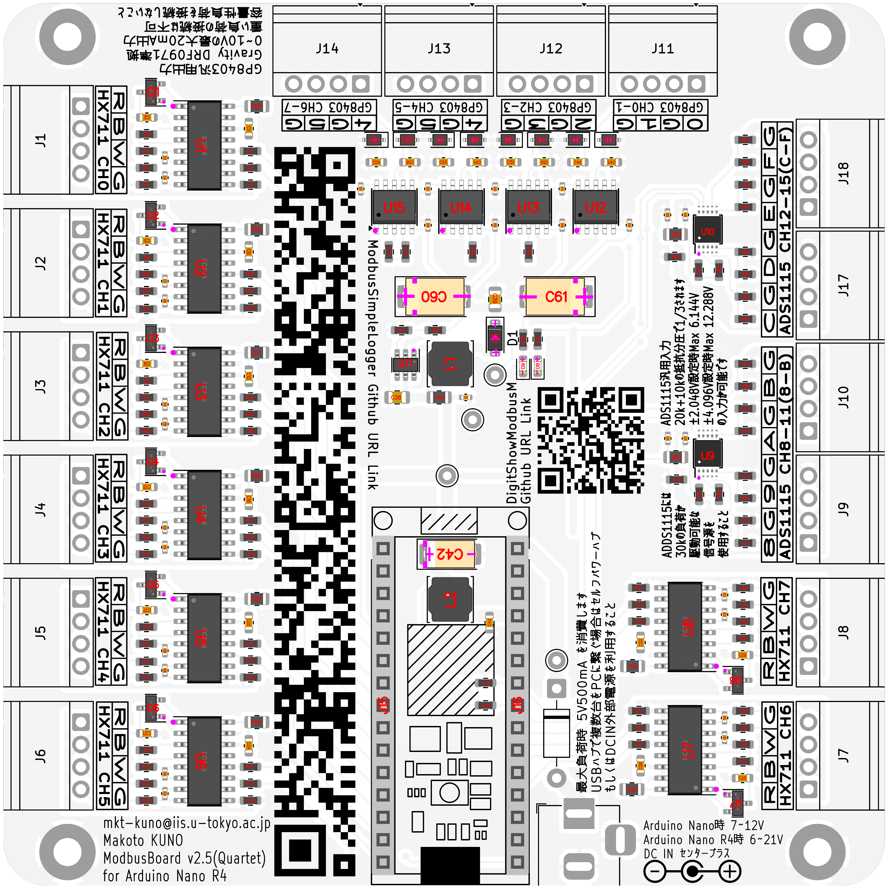
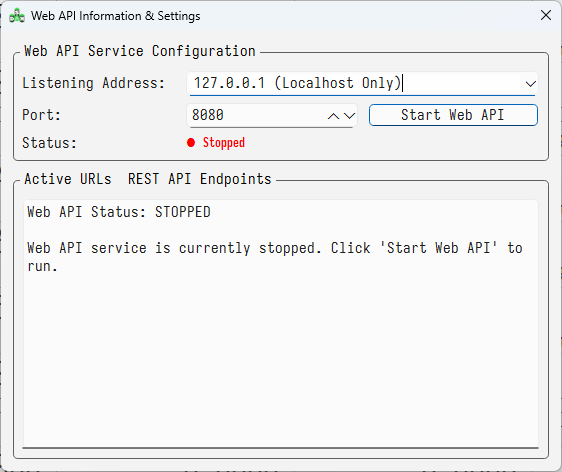

# デベロッパーマニュアル

この章ではハードウェア設計者、ソフトウェア開発者向けの情報を記載します。
DigitShowModbusのビルド方法や、専用のModbusRTUボードについて、装置開発に必要な情報が含まれています。

## 目次
- [起動時変数](#起動時変数)
- [ビルド環境構築](#ビルド環境構築)
- [コントロールの追加・修正](#コントロールの追加修正)
- [Modbusボードについて](#modbusボードについて)
- [各ICの性能と説明](#各icの性能と説明)
- [Web API 機能（開発者向け）](#web-api-機能開発者向け)
- [Modbusプロトコル仕様](#modbusプロトコル仕様)

## 起動時変数

### ModbusRTU AD/DA Board

通信方法が"USBシリアル変換IC"か、"USB CDC-ACMによるマイコンとのダイレクト通信"かの選択の起動引数が存在します。
AnalogInputのInputRegisterの"int16_t" / "float32_t" の選択は起動引数では指定できず、`AioBoardOpen()` 内で自動的に判定されます（対応ボードが接続されている場合、レジスタ5000番台の読み取り可否で判定）。

USB CDC-ACMによるダイレクト通信での高速ポーリング処理の有効化には
完全表記が`--usb_cdc_direct=`、短縮表記が`-ucd=`です。
"True"もしくは"true"、"1"を指定することで高速ポーリングが有効になります。

InputRegisterの精度をfloat32_t（FloatInputRegister）にすると、
int16_t で通信されるデータに、小数点以下の値を拡張する形で通信されます。
その為、キャリブレーションなどに影響はありません。
対応ボードでは自動的に精度が拡張されます。

大まかな動作の違いを以下に示します。

*表: 各ボードの機能概要*

| BoardName | AD | DA | USB-Direct | FloatInput | Other |
| ---: | :--- | ---: | ---: | ---: | ---: |
| Trio（v1） | 16 | 6 | False | False | |
| Quartet（v2） | 16 | 8 | False | False | |
| Quartet（v2.5） | 16 | 8 | True | True | |
| Yamanin（v3） | 16 | 8 | True | True | |
| Milia（v4） | 16 | 8 | True | True | |
| Modulo（v5） | 16 | 8 | True | False | |


*図: Trio（v1）ボード*

ボードは緑で、上部DA出力コネクタが3個（6ch）なのが特徴です。


*図: Quartet（v2）ボード*



*図: Quartet（v2.5）ボード*

ボードは白で、全てのコネクタが着脱式なのが特徴です。


*図: Yamanin（v3）ボード*

ボードが黒く、Zephyrのロゴが入っており、NeoPixel LEDが搭載されていること、DA出力の付近の素子が小型化されていることが特徴です。


*図: Milia（v4）ボード*

ボードが正方形でなくなり、下側にHX711、上側にその他I/Oがまとめられていることが特徴です。

### ModbusRTU COM Port
完全表記が`--port=`、短縮表記が`-p=`です。

ModbusRTUボードとの通信に使用するCOMポートを指定するための引数です。
`--port=COM10`や`-p=COM6`のように指定します。
Trio（v1）・Quartet（v2）では、製造時期や互換ボードかどうかによって、FT232やCH340など、何かしらのUSBシリアル変換ICを使用しているため、デバイスマネージャー等で確認しましょう。
また、動作際してはドライバが必要になります。
ArduinoIDEをインストールするか、多くの場合WindowsUpdateのAdditional Updateでドライバがインストール可能です。
Yamanin（v3）では、USB-CDC（ACM）を使用した高速・高信頼のシリアル通信を採用しており、基本的にWindows標準のドライバが利用可能なため、追加のドライバインストールは不要です。
DSM v5.0.5 以降のバージョンでは、自動のCOMポート認識機能が搭載されていますが、他にArduinoなどを接続していると競合します。  
確実な動作をさせるためにも、デバイスマネージャーで、デバイスを挿抜しながらボードのCOMポートを識別子、確実な設定をしましょう。  


*図: COMポートの例*

### 動作モード
完全表記が`--mode=`、短縮表記が`-m=`です。

"0"もしくは"motor"を指定することで生研式モータ動作モードで起動します。

"1"もしくは"torsional"を指定することで生研式ねじり試験動作モードで起動します。

基本的にMotor動作モードで起動することをお勧めします。ねじりモードは開発中です。
Debugビルドで試用して、安全性を確認してから長期運用してください。

### 引数書式に関する共通仕様
すべての起動引数には、以下の共通仕様に従う必要があります。

- 引数のキー名・真偽値は**大小文字を区別**します。例えば `--LISTEN=` は無視され、`True`/`true`/`1` のみが真と解釈されます。
- 引数は `--key=value` または `-k=value` の形式のみ受け付けます。空白で区切る `--key value` 形式は不可です。
- 不明なキーや不正な値は無視されます。その場合、アプリは既定値で動作します。
- 引数は複数指定可能ですが、同じキーが複数回ある場合は**最初の値が採用**されます。

### クラッチ&モータ動作電圧
完全表記が`--invert_motor_enable=`、短縮表記が`-ime=`です。

完全表記が`--invert_motor_direction=`、短縮表記が`-imd=`です。

"True"もしくは"true"、"1"を指定することで極性が反転します。
デフォルト状態はソースコードの確認をしてください。大きな変更が加わっていない限りは，
"モータON"が"$`5.0\,\mathrm{[V]}`$"、"モータOFF"が"$`0.0\,\mathrm{[V]}`$"。
同じように"モータUP"が"$`5.0\,\mathrm{[V]}`$"、"モータDOWN"が"$`0.0\,\mathrm{[V]}`$"です。
コードを検索する場合は下記のような記述を探してください。

**CDigitShowModbus.cpp より抜粋**

```cpp
#define DSM_AO_DEF_VLT_MOTOR_ON (5.0f)			// Voltage of Axial Motor ON
#define DSM_AO_DEF_VLT_MOTOR_OFF (0.0f)			// Voltage of Axial Motor OFF
#define DSM_AO_DEF_VLT_MOTOR_UP (5.0f)			// Voltage of Axial Motor UP
#define DSM_AO_DEF_VLT_MOTOR_DOWN (0.0f)		// Voltage of Axial Motor DOWN
```

なお、`--invert_motor_enable=` / `--invert_motor_direction=` は Motor 動作モードの電圧極性にのみ影響し、Torsional 動作モード（`--mode=torsional`）の極性には影響しません。

### 設定ファイルの自動保存・復元
キャリブレーション係数（a/b/c）、Chart軸選択、AO Cal（a/b）などのユーザー設定は、`%APPDATA%\DigitShowModbus\config.json` に自動保存・復元されます。
- アプリ起動時（`CDigitShowModbusDoc` のコンストラクタ内）に `AutoRestoreFromJsonConfig()` が呼ばれ、前回終了時の設定ファイルを読み込みます。
- アプリ終了時（`CDigitShowModbusDoc` のデストラクタ内）に `AutoSaveToJsonConfig()` が呼ばれ、同じファイルへ自動保存します。
- ファイルが存在しない、または読み込みに失敗した場合は、警告ログを出した上で既定値で起動します。

### 多重起動防止
同じ Mutex 名 `"DigitShowModbus Application"` を用いて多重起動を防止しています。既に DigitShowModbus が起動している状態で 2 つ目を起動しようとすると、メッセージダイアログが表示された後にアプリが終了します。

### 起動時のランタイム動作
- `SetThreadExecutionState(ES_CONTINUOUS | ES_SYSTEM_REQUIRED | ES_DISPLAY_REQUIRED)` を呼び出し、制御中・データ保存中に OS がスリープしたり画面がオフになるのを抑止します。
- `SetPriorityClass(REALTIME_PRIORITY_CLASS)` でプロセス優先度を Realtime に設定し、計測・制御ループの遅延を抑えます。
- `MainFrm::PreCreateWindow` において、ウィンドウサイズを画面の `SM_CXSCREEN` / `SM_CYSCREEN` に合わせ、`WS_THICKFRAME` を外すため、ウィンドウのリサイズはできません。
- ウィンドウのタイトルは `DigitShowModbus v<バージョン> [<コミットハッシュ短縮>] (debug|release) (dirty)` の形式で表示されます（`dirty` は Git の作業ツリーが dirty の場合のみ付加されます）。

## ビルド環境構築
ビルド環境の構築は、ソースコードと同じフォルダにMarkdown形式のドキュメントが有るので、それを参照します。  
Visual Studio Code(以下:VSCode)前提の作りになっています。  
Clone してきたソースコードのフォルダを開くことで開発を開始してください。

### ソースコードの取得
取得にはGitが必須です。最低限学習して、コミット、という単語の意味が分かるようにしてください。

`git clone https://github.com/mkt-kuno/DigitShowModbus.git`

のように、分割して必要なコマンドを実行してください。詳しくはGitのドキュメントを参照してください。

### 環境の構築(Windows)
- DigitShowModbus/BUILD_WIN.md  
- DigitShowModbus/BUILD_WIN_MINGW.md  

のいずれかを選択して、内容に従います。  
BUILD_WIN だと Visual Studio 20xx 系のビルドシステムを利用するため、立ち上げまで、ダウンロード・インストールにかなりの時間と容量を要します。  
ですが比較的、不具合の検索時などでMicrosoft公式の情報が出やすいですので、手順の簡単さだけ見れば初心者向きかもしれません。  

MINGWの方法だと最小限のパッケージ、最小限のリソースのみを利用してビルドシステムを構築します。  
Linuxとかなり互換性の高いビルド方法と成っており、ビルドも高速で、ストレスが少ないはずです。  
将来的に、Linuxに移行したい、Linuxを既に使っているという人はこちらを利用したほうが良いでしょう。

### 環境の構築(Linux)
- DigitShowModbus/BUILD_LINUX.md  

には、Linux向けの開発情報を記載しています。  
Linuxの場合は、Windowsと違って、aptで導入可能なパッケージが多いため、むしろWindowsよりも開発が簡単でしょう。  
こちらの場合もVSCode前提の構成となっています。

### VSCodeでの作業
[Terminal] -> [Run Tasks] に便利なコマンドを詰めてあります。  
環境によっては動きませんが、生成AIに聞きながら頑張って進めましょう。  

### トラブルシューティング
生成AIに聞きながら勉強しなさい。

## コントロールの追加・修正
`src/DigitShowModbusDoc.cpp` 及び `src/DigitShowModbusDoc.h` を起点として、`src/Control_xxxx.cpp`と`src/Control_xxxx.h`を編集します。
そもそもの前提知識として、自分にあった`C++`の教材で（なんでもいいです）、ポインタとクラスまで学んでおくことを強くお勧めします。
そこまでの知識がないと、何を書いて良いか分からなく可能性が非常に高いです。
Pythonの事前知識があればとっつきやすと思いますが、C++はPythonとは異なる部分が多いです。
正しくない記述に寄ってプログラムがクラッシュしたとしても、Pythonのようにエラー箇所がわかりやすく提示されません。

加えて、初心者レベルで良いので、Git習得を強く推奨します。Gitを使っていないと、コードのバックアップや、間違った修正を戻すことが非常に困難です。
Gitを使用していな場合、コードの変更点がわからなくなったプログラムを持って来ても、救いませんし、救えません。
上記の点に留意し、勉強したうえでコントロールを修正してください。

多くの人が修正を加えたいのは、`CDigitShowModbusDoc::ControlMain`での処理になると思います。
以下にIISモーターモードでの処理の例を示します。

IDが1（CONTROL_TYPE_PRECONSOLIDATION）の場合は、`Control_PreConsolidation`を呼び出します。これは見ての通り、"Step Control"からではない先行圧密用の関数です。

IDが15（CONTROL_TYPE_STEP）の場合は、`Control_FileCtrl_xxxxx`関数群を呼び出します。これがメイン機能の "Step Control"で実行されるプログラム群です。

本当に動いているか不安な場合は"Release"ビルドでもログの出る`spdlog::info`をどんどん追加して、ログを出力してください。

また、変なC/C++コードを追加すると、"Release"モードではコンパイラによる最適化され、コードが無視されたり、意図しない挙動になったります。
その結果"Debug"モードでは動くのに"Release"モードでは動かない、という事象が発生する可能性があります。
自分の書いたコードが不安なら"Debug"モードで動作させましょう。

**Control_Motor.cpp より抜粋**

```cpp
void Control_Motor::Main()
{
	spdlog::trace("{}", __FUNCTION__);

	auto ctx = GetCDSBContext();
	if (ctx->Flag.control == FALSE)
		return;

	nlohmann::json _for_spdlog;

	spdlog::debug("MOTOR_ControlMain Ctrl Type:{}", (int)ctx->Control.type.load());

	switch (ctx->Control.type)
	{
	case CONTROL_TYPE_NONE:
		break;
	case CONTROL_TYPE_PRECONSOLIDATION:
		Control_PreConsolidation();
		break;
	case CONTROL_TYPE_STEP:
	{
		auto ctrl_step = ctx->Control.current_step.load();
		auto ctrl_step_cc = ctx->Control.Step[ctrl_step].ctrl.load();
		auto ctrl_step_args = ctx->Control.Step[ctrl_step].args;
		_for_spdlog["current_step"] = ctrl_step;
		_for_spdlog["step_num"] = ctrl_step_cc;
		for (int i = 0; i < DSM_STEPCTRL_ARGS_MAX; i++)
		{
			_for_spdlog["args"][i] = ctrl_step_args[i].load();
		}
		spdlog::info("{}:{}", __FUNCTION__, _for_spdlog.dump());

		if (ctrl_step_cc == 0)
		{
			// No Control
			Set_Speed(0.0f); // RPM->0
		}
		if (ctrl_step_cc == 1)
			Control_Motor::Control_FileCtrl_MonotonicAxialLoading();
		if (ctrl_step_cc == 2)
			Control_Motor::Control_FileCtrl_CyclicAxialLoadingStress();
		if (ctrl_step_cc == 3)
			Control_Motor::Control_FileCtrl_CyclicAxialLoadingStrain();
		if (ctrl_step_cc == 4)
			Control_Motor::Control_FileCtrl_Creep();
		if (ctrl_step_cc == 5)
			Control_Motor::Control_FileCtrl_LinearStressPathLoading();
		break;
	}
	default:
		break;
	}
}
```

## Modbusボードについて

### 基本機能とピン配置
ボードには3種類のコネクタがあります。HX711-ひずみ入力用コネクタ、ADS1115-電圧入力用コネクタ、GP8403-電圧出力用コネクタです。


*図: HX711-ひずみ入力用コネクタの簡易説明*

歪入力は4線もしくはシールド線を含む5線で接続します。Vin、GND、SIG+、SIG-、SHIELDの5本です。
シールド線は必須ではありませんが、ノイズ対策として接続することをお勧めします。
またこれらの色は一般的なロードセルの配線色に合わせていますが、必ずしも**そうでない**場合があります。
**必ずテスターなどで抵抗値を測定し**、正しい配線を確認してください。
一般的な抵抗値テーブルを以下に示します。


*図: ひずみゲージ抵抗値テーブル*

ADS1115は前述の通り、電源入力のコネクタです。1ブロックにつき4入力あります。
CH10から先は16進数表記で A（10）、B（11）、C（12）、D（13）...となります。
必ず入力信号側に赤色のケーブルを接続し、ターゲットデバイスのGNDと入力チャンネル横のGNDを接続してください。逆接続するとボード、もしくはターゲットデバイスが破損します。
GP8403は電圧出力用のコネクタです。1ブロックにつき2出力あります。
必ず出力信号側に赤色のケーブルを接続し、ターゲットデバイスのGNDと出力チャンネル横のGNDを接続してください。逆接続するとボード、もしくはターゲットデバイスが破損します。
Gは予約文字でGND接続を意味します。


*図: その他コネクタの簡易説明*

### Modbus TCP/RTU/ASCII
Modbusとは、1979年にModicon（現在のSchneider Electric）が開発した通信プロトコルです。
Modbusは、RS-232CやRS-485などのシリアル通信を使用するModbus RTU/ASCIIと、TCP/IPを使用するModbus TCPの2つのバージョンがあります。
TCP/IPを使用するには全台がDHCP対応でオンラインなネットワークに属しているか、静的IPで設定されたクローズドネットワークに属している必要があります。
今日日、多くの大学、会社でネットワークの管理が厳しくなっているため、本プロジェクトでは物理接続で動作が可能なModbus RTU/ASCIIを選択しました。

次にRTUとASCIIとの違いですが、どちらも同じシリアル転送、をベースとした技術です。RTUはバイナリ形式で、ASCIIはテキスト形式で通信します。
要は人間が通信内容を見たときに分かるか（テキスト形式）どうか、という感じです。
RTUはバイナリ形式で通信するため、通信速度が速く、ASCIIはテキスト形式で通信するため、通信速度が遅いです。
本プロジェクトでは将来的に通信レートが向上することに対応するため、RTUを選択しました。

### シリアル通信
最近ではArduino、また多くの電子天秤や制御機器で"Serial"や"シリアル通信"、"UART"、"RS-232C"などの用語を見かけると思います。
厳密なことはおいておいて、これらの単語は同じ通信方式を指すと言っていいでしょう。
TX（送信）とRX（受信）これらの対によって、ホスト（Windowsなど）とデバイス（Arduinoなど）が通信を行います。
通信内容は基本的に文字列通信ですが、バイナリ通信も可能です。多くの場合文字列通信が使用されるというだけです。

ここでシリアル通信の種別について、RS-232C、RS-422、RS-485、USB-CDCなどがあります。

RS-232Cは古い規格で、シングルエンド通信のため最大通信速度が遅いですが、通信距離が長いです。
1対1の通信が可能で、通信線には最低限GND、TX+、RX+の3本が必要です。

RS-422はRS-232Cの改良版で、差動通信かつTX, RXが別れているため通信速度が速く、通信距離も長いです。
1対1の通信が可能で、通信線には最低限GND、TX+、TX-、RX+、RX-の5本が必要です。GNDを除いた4本て大丈夫な、絶縁通信もあります。

RS-485はRS-422の改良版で、差動通信でTX/RXをまとめた形のため、マルチポイント通信が可能です。
1対多の通信が可能で、通信線には最低限GND、D+、D-の3本が必要です。GNDを除いた2本て大丈夫な、絶縁通信もあります。

USB-CDCはシリアル通信を全部USBに乗せて通信するための規格です。USB-CDCはUSBのため、通信速度が速く、通信距離も長いです。
1対1の通信が可能で、通信線には最低限GND、D+、D-の4本が必要です。

例えばArduino Uno/Nanoでは、PCからArduinoボードに搭載されたFT232/CH340などのUSBシリアル変換ICまではUSB-CDCでUSB通信し、その後はFT232/CH340などのシリアル変換ICからRS-232Cでマイコンと通信を行います。
[後述するYamanin（v3）](#modbusボード-v3yamanin)ではPCからマイコンボードまで直接USBが通信線として使用されており、ロスや遅延、無駄な処理なくシリアル通信が行われます。

### シングルエンド信号と差動信号
このような、接続できる機器の数、伝送距離、伝送速度、ノイズ耐性、電源電圧などの要素を考慮して、通信方式を選択する際に出てくるワードが、シングルエンド信号と差動信号です。
シングルエンド信号は、信号線とGNDの間で信号を送る方式です。例えばArduino等の場合、$`5\,\mathrm{V}`$で動作していれば、信号線が$`3\,\mathrm{V}`$以上でHIGH、$`1\,\mathrm{V}`$以下でLOWというように、GNDとの電圧差で信号を判断します。
これは同時に外部から瞬間的に3V程度のノイズが乗った際に、もしくはアースやグランドが不安定になると誤動作を起こす可能性があります。
なのでテレビのリモコンなんてのは、なんとなくのGNDで動作するシングルエンド信号で動作しているため、リモコンをテレビの前に持っていかないと反応しない、方向が悪いと反応しないということがあります。
他には液晶のD-SUBなんてのは、シングルエンド信号で動作している上、あろうことかアナログ信号なので、端子の刺さりが甘かったり、端子を触ってノイズが乗ると画面が大きく乱れることがあります。

差動信号は、信号線と信号線の間の電圧差で信号を送る方式です。例えばRS-485などの場合、TX+とTX-の間で信号を送ります。
例えばTX+（例：$`+2\,\mathrm{V}`$）とTX-（例：$`-2\,\mathrm{V}`$）電圧差が$`4\,\mathrm{V}`$以上ならHIGH、例えばTX+（例：$`-2\,\mathrm{V}`$）とTX-（例：$`+2\,\mathrm{V}`$）電圧差が$`-4\,\mathrm{V}`$以下ならLOWというように、信号線間の電圧差で信号を判断します。
これは先ほどと違い、外部からノイズが乗っても、信号線間の電圧差が変わらない限り、誤動作を起こしにくいです。
身の回りだと、有線LANやUSB、HDMI、DVIなどが差動信号で通信しています。有線LANは 4対の通信線。USB 1.0/2.0 は 2対の通信線です。USB 3.0 は高速化の更に通信対を足しています。
要は、高速・安定の通信をするには差動信号が良い、ということです。

### フィールドネットワーク
フィールドネットワークとは、工場や建物内の機器やセンサー、アクチュエーターなどを接続するためのネットワークです。
我々の用途も、砂・水・油・薬品を利用するため、フィールドネットワークを使用している、と言っていいでしょう。
フィールドネットワークには、Profibus、DeviceNet、EtherCAT、CC-Link、Modbus、CAN、PROFINET、EtherNet/IP、POWERLINK、Sercos、IO-Link、AS-Interface、HART、Bluetooth、Zigbee、Threadなどがあります。
あまりに多すぎますが、この殆どがライセンス絡みで有料で、ホスト側のデバイスも高価である場合が多いです。
この中で比較的安価に利用可能なのが、CAN、Modbus、Bluetoothあたりです。

CANは車載向けで多く使われてきた実績があり、車体全体のアースをGNDとすることで、1対の差動線のみで通信が可能で、一本の線が切れても通信が可能、加えて複数デバイスを接続することが可能です。
この技術は3Dプリンタにも応用され、多くのフラッグシップ3Dプリンタは、高速に動作させたいホットエンド部分につながる線を、通信速度と信頼性を保ったまま減らすため、CANを採用しています。
我々の用途の場合、CANの通信プロトコルが複雑であることと、1回あたりの通信（メッセージ）長が短い事が問題になります。

Bluetoothは無線のため、否が応でも予期しない遅延が、かつ電波環境依存で安定しない遅延時間が発生します。計測レートが$`1\,\mathrm{sample/s}`$程度ならば気になりませんが、高速計測を行う場合は、遅延が問題になるので、今回は考慮しませんでした。

残されたのがModbus、とくにRTUでした。Modbus RTUは、基本的にはRS-485を使用するため、差動信号で通信が行われ、信頼性が高いです。また、RS-485はマルチポイント通信が可能で、複数のデバイスを接続することが可能です。
しかし、RS485ではなくUSB-CDCを使用すれば、1対1通信の限定になりますが、高速通信を行うことが可能です。Arduinoなどをデバイスとするのであれば、ライブラリも多く存在し、仕様もオープンなため、開発がしやすいというメリットもあります。
またModbus TCPという上位規格があるため、物理接続がいよいよ廃れ始めた頃にTCP/IPへの以降もスムーズに進むと考えられます。
諸々の理由により、本プロジェクトではModbus RTUを採用しました。

### Modbusボード v1（Trio）/v2（Quartet）
- 開発コード：Trio（v1）/Quartet（v2）
- マイコン：Arduino Nano（ATmega328p）
- プラットフォーム：Arduino
- 通信方式：USBシリアル
- 通信プロトコル：Modbus RTU
- 通信速度：$`38400\,\mathrm{bps}`$
- 入力-HX711：$`1\,\mathrm{ch}`$/ic, 計$`8\,\mathrm{ch}`$, $`16\,\mathrm{bit}`$精度, 128倍ゲイン,$`10\,\mathrm{Hz}`$動作
- 入力-ADS1115：$`4\,\mathrm{ch}`$/ic, 計$`16\,\mathrm{ch}`$, $`16\,\mathrm{bit}`$精度, $`64\,\mathrm{Hz}`$動作（オプションで$`128\,\mathrm{Hz}`$）
- 出力-GP8403：$`2\,\mathrm{ch}`$/ic, 計6/$`8\,\mathrm{ch}`$, $`12\,\mathrm{bit}`$精度, オンデマンド動作

### Modbusボード v2.5（Quartet）
- 開発コード：Quartet（v2.5）
- マイコン：Arduino Nano R4（RA4M1）
- プラットフォーム：Arduino
- 通信方式：USBシリアル(Native CDC)
- 通信プロトコル：Modbus RTU
- 通信速度：$`38400\,\mathrm{bps}`$
- 入力-HX711：$`1\,\mathrm{ch}`$/ic, 計$`8\,\mathrm{ch}`$, $`16\,\mathrm{bit}`$精度, 128倍ゲイン,$`10\,\mathrm{Hz}`$動作
- 入力-ADS1115：$`4\,\mathrm{ch}`$/ic, 計$`16\,\mathrm{ch}`$, $`16\,\mathrm{bit}`$精度, $`64\,\mathrm{Hz}`$動作（オプションで$`128\,\mathrm{Hz}`$）
- 出力-GP8403：$`2\,\mathrm{ch}`$/ic, 計6/$`8\,\mathrm{ch}`$, $`12\,\mathrm{bit}`$精度, オンデマンド動作

### Modbusボード v3（Yamanin）
- 開発コード：Yamanin（v3）
- マイコン：STM32F411CE（BlackPill）
- プラットフォーム：Zephyr RTOS
- 通信方式：USBシリアル(Native CDC)
- 通信プロトコル：Modbus RTU
- 通信速度：$`38400\,\mathrm{bps}`$（USBダイレクトのため、何でも良い）
- 入力-HX711：$`1\,\mathrm{ch}`$/ic, 計$`8\,\mathrm{ch}`$, $`16\,\mathrm{bit}`$精度, 128倍ゲイン, $`80\,\mathrm{Hz}`$動作, 単純加算平均（8サンプル）
- 入力-ADS1115：$`4\,\mathrm{ch}`$/ic, 計$`16\,\mathrm{ch}`$, $`16\,\mathrm{bit}`$精度, $`128\,\mathrm{Hz}`$動作
- 出力-GP8403：$`2\,\mathrm{ch}`$/ic, 計$`8\,\mathrm{ch}`$, $`12\,\mathrm{bit}`$精度, オンデマンド動作

### Modbusボード v4（Milia）
- 開発コード：Milia（v4）
- マイコン：Raspberry Pi Pico（RP2040）
- プラットフォーム：Arduino
- 通信方式：USBシリアル(Native CDC)
- 通信プロトコル：Modbus RTU
- 通信速度：$`38400\,\mathrm{bps}`$（USBダイレクトのため、何でも良い）
- 入力-HX711：$`1\,\mathrm{ch}`$/ic, 計$`8\,\mathrm{ch}`$, $`16\,\mathrm{bit}`$精度, 128倍ゲイン,$`10\,\mathrm{Hz}`$動作
- 入力-ADS1115：$`4\,\mathrm{ch}`$/ic, 計$`16\,\mathrm{ch}`$, $`16\,\mathrm{bit}`$精度, $`64\,\mathrm{Hz}`$動作（オプションで$`128\,\mathrm{Hz}`$）
- 出力-GP8403：$`2\,\mathrm{ch}`$/ic, 計6/$`8\,\mathrm{ch}`$, $`12\,\mathrm{bit}`$精度, オンデマンド動作

## 各ICの性能と説明

### ひずみ入力IC：HX711
$`24\,\mathrm{bit}`$精度のADCを搭載した、内臓で128倍のゲインを持ち、$`10\,\mathrm{Hz}`$もしくは$`80\,\mathrm{Hz}`$のサンプリングレートを持った高精度なアナログデジタルコンバータです。
ゲージ電圧$`1`$〜$`5\,\mathrm{V}`$程度の、フルブリッジ式のひずみセンサーの接続に適しています。
出力される値は本来であれば、符号付き$`24\,\mathrm{bit}`$精度ですが、ノイズ等により実質的な性能が$`16\,\mathrm{bit}`$程度のため、本プロジェクトでは符号付き$`16\,\mathrm{bit}`$精度（int16_t/i16）として扱っています。

動作電圧が$`2.048\,\mathrm{V}`$の場合の物理値と、ゲイン済み電圧、ゲイン前電圧、の関係を表すと以下の表のようになります。

*表: HX711の物理値と換算式*

| 物理値 | 物理値 | 差圧（128倍）$`[\mathrm{mV}]`$ | 差圧$`[\mathrm{mV}]`$ | 電圧$`[\mathrm{mV}]`$ | 出力（E=2）$`[\mathrm{mV/V}]`$ |
| ---: | ---: | ---: | ---: | ---: | ---: |
| 32767 | 0x7FFF | 2048 | 16 | 8 | 3.906 |
| 16384 | 0x4000 | 1024 | 8 | 4 | 1.953 |
| 8192 | 0x2000 | 512 | 4 | 2 | 0.977 |
| 4096 | 0x1000 | 256 | 2 | 1 | 0.488 |
| 2048 | 0x0800 | 128 | 1 | 0.5 | 0.244 |
| 0 | 0x0000 | 0 | 0 | 0 | 0 |
| -4096 | 0xF000 | -256 | -2 | -1 | -0.488 |
| -8192 | 0xE000 | -512 | -4 | -2 | -0.977 |
| -32768 | 0x8000 | -2048 | -16 | -8 | -3.906 |

HX711のint16_t（i16）物理値からmV/V、もしくはμεへの定格出力値への変換については、以下の式を使用してください。

$$
\begin{align}
    \Delta e            &= \frac{E}{4} K\varepsilon  & \left[\mathrm{V}\right] \\
    \varepsilon         &= \frac{4\Delta e}{KE} & \left[\varepsilon\right]\\
    \frac{\Delta e}{E}  &= \frac{\mathrm{Raw}_\mathrm{i16}}{\mathrm{INT16\_MAX} \times \mathrm{HX711\_GAIN} \times \mathrm{DIFF}}  & \\
                        &= \frac{\mathrm{Raw}_\mathrm{i16}}{32767 \times 128 \times 2} & \left[\mathrm{V}\right]  \\
    \mu\varepsilon      &= \frac{\mathrm{Raw}_\mathrm{i16}}{\mathrm{INT16\_MAX} \times \mathrm{HX711\_GAIN} \times \mathrm{DIFF}} \times K \times 1\mathrm{E}6 & \\
                        &= \frac{\mathrm{Raw}_\mathrm{i16}}{32767 \times 128 \times 2} \times 2.0 \times 1\mathrm{E}6 & \left[\mu\varepsilon\right]
\end{align}
$$

$$
\begin{align}
    \Delta e    &: \text{負荷時の出力電圧} & \left[\mathrm{V}\right] \\
    E           &: \text{印加電圧} & \left[\mathrm{V}\right]  \\
    K           &: \text{ゲージ率（殆どの場合2.0）} &   \\
    \varepsilon &: \text{ひずみ} & 
\end{align}
$$

### 汎用入力IC：ADS1115
シングルエンド入力と差動入力が可能な$`16\,\mathrm{bit}`$精度のADCを搭載した、I2C接続のアナログデジタルコンバータです。最大CHはシングルエンドジ4つで、差動入力で2つです。
入力電圧範囲は最大で$`-6.144`$〜$`+6.144\,\mathrm{V}`$で、計測レートは$`8`$〜$`860\,\mathrm{sample/s}`$まで設定可能です。
計測レートを上げすぎると精度が下がり、計測レートを下げすぎるとチャンネル間の遅延が大きくなるため、使用される想定レートに合わせ、本プロジェクトでは$`7`$〜$`8\,\mathrm{ms/1ch}`$（$`32\,\mathrm{ms}/4\,\mathrm{ch}`$） 程度の計測レートで使用しています。

ADS1115ののint16_t（i16）物理値の換算表、換算式は以下の表のようになります。

*表: ADS1115の物理値と換算式*

| 物理値 | 物理値 | 電圧 |
| ---: | ---: | ---: |
| 32767 | 0x7FFF | 6.144 |
| 16384 | 0x4000 | 3.072 |
| 8192 | 0x2000 | 1.536 |
| 4096 | 0x1000 | 0.768 |
| 0 | 0x0000 | 0.000 |
| -4096 | 0xF000 | -0.768 |
| -8192 | 0xE000 | -1.536 |
| -32768 | 0x8000 | -6.144 |

$$
\begin{align}
    V   &= \frac{\mathrm{Raw}_\mathrm{i16}}{\mathrm{INT16\_MAX}} \times \mathrm{ADS1115\_RANGE} & \\
        &= \frac{\mathrm{Raw}_\mathrm{i16}}{32767} \times 6.114 & \left[\mathrm{V}\right]
\end{align}
$$

### 電圧出力IC： GP8403
$`12\,\mathrm{bit}`$精度のDACを搭載した、I2C接続のデジタルアナログコンバータです。最大CHは2つで、出力電圧範囲は$`0`$〜$`10.0\,\mathrm{V}`$です。
このICのみ入出力の指定8bitの倍数にうまく収まらないため、DFRobot社のGP8403ライブラリ互換の出力値指定方法となっています。
具体的には、指定値がuint16_tの範囲を取り、$`\mathrm{mV}`$オーダーで出力電圧を指定します。

GP8403のuint16_t（u16）物理値の換算表、換算式は以下の表のようになります。

*表: GP8403の物理値と換算式*

| 物理値 | 物理値 | 出力電圧$`[\mathrm{mV}]`$ | 出力電圧$`[\mathrm{V}]`$ |
| ---: | ---: | ---: | ---: |
| 10000 | 0x2710 | 10000 | 10.0 |
| 5000 | 0x1388 | 5000 | 5.0 |
| 2000 | 0x07D0 | 2000 | 2.0 |
| 1000 | 0x03E8 | 1000 | 1.0 |
| 100 | 0x0064 | 100 | 0.1 |
| 0 | 0x0000 | 0 | 0.0 |

### Arduino Nano
Arduino Uno R3の小型版で、ATmega328P（一部、ATmega168）を搭載したマイコンボードです。シリアル変換チップを搭載しており、シリアル通信が可能です。
$`8\,\mathrm{bit}`$のCPU命令、$`16\,\mathrm{MHz}`$のクロック、$`32\,\mathrm{KB}`$のフラッシュメモリ（実行ファイル用ストレージ）、$`2\,\mathrm{KB}`$のRAM（メモリ）、$`1\,\mathrm{KB}`$のEEPROM（データ保存用ストレージ）を搭載しています。
Trio、Quartetの制御用マイコンとして使用されていますが、HX711を$`80\,\mathrm{Hz}`$駆動で加算移動平均を適用しようとしたところ、処理が追いつかないため、Yamaninに移行する際に使用されなくなりました。
$`8\,\mathrm{bit}`$マイコンはその性質上、$`8\,\mathrm{bit}`$の加減算が1クロックで、$`16\,\mathrm{bit}`$の加減算が2クロック、$`32\,\mathrm{bit}`$の加減算が4クロックかかるため、処理が遅くなります。
特に剰余算の場合は、更に遅くなるため、単純移動平均であっても処理が間に合わなくなったものと思われます。

### WeAct Studio BlackPill STM32F411CE
STM32F411CEを搭載したマイコンボードで、ARM Cortex-M4の$`32\,\mathrm{bit}`$マイコンです。$`100\,\mathrm{MHz}`$のクロック、$`512\,\mathrm{KB}`$のフラッシュメモリ、$`128\,\mathrm{KB}`$のRAMを搭載しています。
先述の通り、HX711の$`80\,\mathrm{Hz}`$対応、加算移動平均処理に対応するためにマイコンの変更が行われました。
また、STM32F411CEは、ZephyerRTOSを使用することによってダイレクトなUSB-CDCが利用可能のため、シリアル変換チップが不要で、USBケーブルを直接接続することが可能です。
$`32\,\mathrm{bit}`$マイコンのため、$`8`$〜$`32\,\mathrm{bit}`$までの加減算が1クロックで行えるため、処理が高速になります。多くの変数が$`16\,\mathrm{bit}`$以上であるため、これは強力な高速化になります。
加えて、CPUの動作周波数も6倍以上であるため、その分処理速度が向上し、パソコンからの処理を遅延なく行えることが出来るようになります。

### Raspberry Pi Pico（RP2040）
Raspberry Pi Picoは、RP2040を搭載したマイコンボードで、ARM Cortex-M0+の$`32\,\mathrm{bit}`$マイコンです。$`125\,\mathrm{MHz}`$のクロック、$`2\,\mathrm{MB}`$のフラッシュメモリ、$`264\,\mathrm{KB}`$のRAMを搭載しています。
RP2040は、Arduinoプラットフォームで使用することができ、Arduino Nanoと同様にUSBシリアル通信が可能です
USB CDC-ACMを使用することにより、シリアル変換チップが不要で、USBケーブルを直接接続することが可能です。
ZephyerRTOSを使用していないため、プロジェクトが簡潔にまとまっています。
コアが２つあるため、独自のルーチンやユーザーアプリケーションを並列に動作させることが可能です。
RP2040本体のADCにはエラッタがあり、$`8\,\mathrm{bit}`$の精度しかないため、使用しないことをおすすめします。

## Web API 機能（開発者向け）

### 概要
DigitShowModbus は、Modbusボードの計測データや時系列プレビューデータをリアルタイムに取得できる **Web API サービス** を内蔵しています。
Python やブラウザ、外部の可視化ツールから HTTP リクエストを送信することで、リアルタイムな状態監視やデータ取得が容易に行えます。

すべての API は CORS（Cross-Origin Resource Sharing）に対応しており、同一オリジンポリシーの制約なく他のドメインやローカルアプリケーションからもアクセス可能です。また、`Accept-Encoding: gzip` を指定することで、JSON レスポンスの gzip 圧縮転送にも対応しています。

### 遠隔監視 UI（DigitShowWebview）との連携
DigitShowModbus の Web API を使用した公式の遠隔監視・可視化アプリケーションとして、**DigitShowWebview**（`https://github.com/mkt-kuno/DigitShowWebview`）が提供されています。

- **動作形態**: 遠隔監視用 PC（または実験用 PC 自身）上で `DigitShowWebview` の実行可能ファイル（`.exe`）を直接起動して使用します（DigitShowModbus 側で静的 Web ページをホストする方式ではありません）。
- **接続設定**: DigitShowWebview 起動後、接続先設定画面にて DigitShowModbus が動作している PC の **IP アドレス**（LAN 内 IP や Tailscale IP 等）と **ポート番号**（既定: `8080`）を入力・保存することで、自動的にリアルタイム通信とグラフ描画が開始されます。

### ホストおよびポート設定
Web API の Listening ホストおよびポートの既定値は `0.0.0.0:8080`（全ネットワークインターフェース・ポート 8080）です。

- **GUI からの変更**: メニューの「Other」→「Web API」を選択すると、Listening アドレス（`0.0.0.0` / `127.0.0.1` 等）およびポート番号を対話的に設定・変更でき、「Restart Web API」で即時再起動できます。設定値はアプリケーション終了時に `config.json` に保存され、次回起動時にも自動復元されます。



*図: Web API 設定ダイアログ*

- **起動時引数での指定**: コマンドライン引数 `--listen="0.0.0.0:8080"` のように指定して起動することも可能です。

### ハートビート / 正常性確認API（v2）
`/v2/heartbeat`に GET リクエストを送ると、サーバーの稼働状態とタイムスタンプを取得できます。

```bash
curl http://localhost:8080/v2/heartbeat
```

**レスポンス例**:
```json
{
  "status": "OK",
  "timestamp": "2026-08-27 11:00:00"
}
```

### リアルタイム計測データの取得API（v2）
`/v2/realtime`に GET リクエストを送ると、最新のセンサ計測値（Raw/Phy/Param/Out）および制御フラグを取得できます。

```bash
curl http://localhost:8080/v2/realtime
```

以下は、計測データの例です。

**計測データJSON 一部抜粋**

```json
{
  "flag": { "control": false, "save_data": false, "set_board": true },
  "out": { "00": { "label": "00:Motor ON/OFF", "value": 0.0 }, "01": {"label": "01:Motor UP/DOWN", "value": 0.0 } },
  "par": { "00": { "label": "00:q(kPa)", "value": 5.225908279418945 }, "01": { "label": "01:p'(kPa)", "value": 1.7425289154052734 } },
  "phy": { "00": { "label": "00:Load(N)", "value": 10.260002136230469}, "01": { "label": "01:ExtDisp(mm)", "value": 0.0 } },
  "raw": { "00": { "label": "00:LoadCell(i16)", "value": 42.0 }, "01": { "label": "01:LVDT(i16)", "value": -3.0 } },
}
```

### プレビュー用データ配列の取得API（v2）
プレビュー用データ配列は、直近の計測データ時系列バッファから取得できます。バッファサイズは非保存時 512 点、データ保存時は最大 32,768 点（リングバッファ方式）となっており、長時間の連続試験でも安定してレスポンスが得られます。
必要なデータ項目をクエリパラメータとして指定して GET リクエストを送信します。
`/v2/preview` に GET リクエストを送ると、プレビュー用データ配列を取得できます。
`http://localhost:8080/v2/preview` でアクセスできます。
計測データはJSON形式で返されます。
例えば `time` と `phy_00` を取得したい場合、
`http://localhost:8080/v2/preview?time&phy_00` のように指定します。

利用可能なクエリパラメータは以下の通りです。

- `time` ： 時刻配列（`elapsed_sec`）を含める
- `timestamp` ： 壁時計時刻配列（Unix Epoch 秒）を含める（`timestamp.label`=`"Epoch[s]"` および `timestamp.data` として返る）
- `raw_XX` ： AI Raw ch XX を含める（XX: 00-15）
- `phy_XX` ： AI Phy ch XX を含める（XX: 00-15）
- `par_XX` ： Param ch XX を含める（XX: 00-31）
- `out_XX` ： AO Raw ch XX を含める（XX: 00-07）

以下は、プレビュー用データ配列の例です。

**プレビュー用データ配列JSON 一部抜粋**

```json
{
    "raw_00": {
        "label": "00:LoadCell(i16)",
        "data": [
            -13.0,
            -13.0,
            -13.0,
            -13.0,
            -13.0,
            -13.0,
            -13.0,
            -13.0,
            -13.0,
            -13.0,
        ]
    },
    "time": {
        "label": "Time[s]",
        "data": [
            0.01899999938905239,
            0.04399999976158142,
            0.05999999865889549,
            0.07100000232458115,
            0.09099999815225601,
            0.10700000077486038,
            0.12300000339746475,
            0.1379999965429306,
            0.15000000596046448,
            0.1679999977350235,
        ]
    }
}
```
