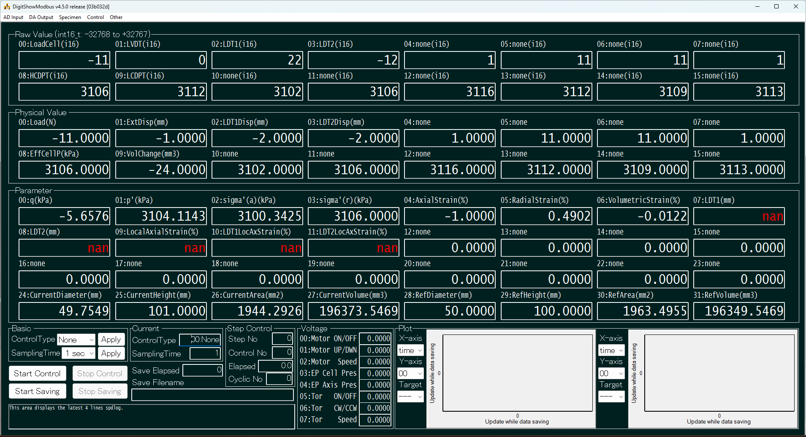
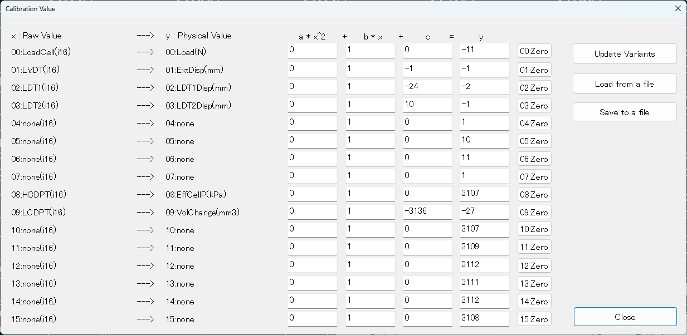
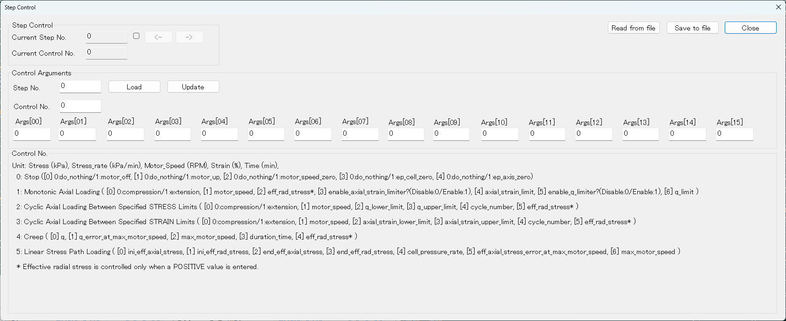

# クイックスタート

ここでは、生研式の三軸試験装置を用いて飽和供試体の三軸圧縮試験を行う際の、DigitShow Modbusの基本的な使い方を示します。

## 目次

- [事前準備：ショートカットの作成](#事前準備ショートカットの作成)
- [実験前：アプリを開く](#実験前アプリを開く)
- [供試体を設置する前：ロードセルのキャリブレーション値の入力](#供試体を設置する前ロードセルのキャリブレーション値の入力)
- [供試体の寸法計測後：供試体初期寸法の入力](#供試体の寸法計測後供試体初期寸法の入力)
- [載荷装置と三軸セルを接続した後①：変位計のキャリブレーション値の入力](#載荷装置と三軸セルを接続した後①変位計のキャリブレーション値の入力)
- [載荷装置と三軸セルを接続した後②：Pre-Consolidation](#載荷装置と三軸セルを接続した後②pre-consolidation)
- [供試体の飽和後：差圧計のキャリブレーション値の入力](#供試体の飽和後差圧計のキャリブレーション値の入力)
- [圧密①：EPの出力調整](#圧密①epの出力調整)
- [圧密②：ひずみの初期化（Before Consolidation）](#圧密②ひずみの初期化before-consolidation)
- [圧密③：Control from fileの設定](#圧密③control-from-fileの設定)
- [圧密④：データ保存と制御の開始](#圧密④データ保存と制御の開始)
- [軸圧縮①：データ保存、圧密の停止](#軸圧縮①データ保存圧密の停止)
- [軸圧縮②：ひずみの初期化（After Consolidation）](#軸圧縮②ひずみの初期化after-consolidation)
- [軸圧縮③：Step No の変更](#軸圧縮③step-no-の変更)
- [軸圧縮④：データの保存、載荷の開始](#軸圧縮④データの保存載荷の開始)
- [片付け](#片付け)

## 事前準備：ショートカットの作成

まず、実行ファイル（`DigitShowModbus.exe`）のショートカットを作成します。

次に、ショートカットのプロパティを開き、起動時変数の設定を行います。ショートカットの“target（リンク先）”の最後に以下の引数を追加してください。

- （必須）AD/DAボードと通信するCOMポートを`--port=COM10`や`-p=COM6`のように指定します。AD/DAボードのポート番号は、デバイスマネージャー等で確認しましょう。
- （試験機によっては必須）動作モードや、クラッチとモータ動作電圧を指定します。詳細は[デベロッパーマニュアル](developer_manual.md)を参照してください。

*図: ポート指定の例。*

## 実験前：アプリを開く

ショートカットをクリックしてアプリを開きましょう。以下の図のようなメイン画面が表示されます。値がすべて0の場合は、AD/DAボードとの通信がうまくできていないので、ポート指定を再確認してください。

*図: メイン画面。*

## 供試体を設置する前：ロードセルのキャリブレーション値の入力

1. 左上の“AD Input”タブで“Calibration Factors”をクリックします。
2. キャリブレーション値を設定します。
   - 手動で各チャンネルの値を入力する場合：a, b, cの係数に値を入力し、“Update Varients”を押します。
   - ファイルを読み込む場合：“Load from a file”をクリックして、`.cal`ファイルを読み込みます。現在の設定を保存する場合、“Save to a file”で保存することができます。
3. カウンターバランスを取った状態で、ロードセルのゼロ点を調整をします。ロードセルのチャンネル（CH0）の“Zero”ボタンを押します。そのチャンネルのphysical valueが0になるように、自動的にキャリブレーション値の定数項（c）が変更されます。

*図: 各センサーのキャリブレーション値の入力画面。*

## 供試体の寸法計測後：供試体初期寸法の入力

1. 左上の“Specimen”タブで“Config”をクリックします。
2. “Initial”列の“Diameter”行と“Height”行に、供試体の初期寸法と高さを入力し、“-> present”ボタンを押します。

*図: 供試体の情報の入力画面。*

## 載荷装置と三軸セルを接続した後①：変位計のキャリブレーション値の入力

[供試体を設置する前：ロードセルのキャリブレーション値の入力](#供試体を設置する前ロードセルのキャリブレーション値の入力)節と同様にして、変位計（LVDT）のチャンネル（CH1）キャリブレーション値の入力およびゼロ点の調整を行います。

## 載荷装置と三軸セルを接続した後②：Pre-Consolidation

Pre-consolidationは所定の$q$（軸差応力$\left[\mathrm{kPa}\right]$）を保つ制御コマンドです。主に供試体の飽和過程で使用します。デフォルトの設定では、$q=0$なので、等方状態になります。

1. メイン画面左下の“Control ID”を 1 にして、“Set”をクリックします。
2. メイン画面左下の“Start Control”を押すと、制御が始まります。軸受けのクランプを緩め忘れないように気を付けてください。

## 供試体の飽和後：差圧計のキャリブレーション値の入力

[供試体を設置する前：ロードセルのキャリブレーション値の入力](#供試体を設置する前ロードセルのキャリブレーション値の入力)節と同様にして、高容量差圧計（HCDPT、CH8）、低容量差圧計（LCDPT、CH9）のキャリブレーション値の入力およびゼロ点の調整を行います。

## 圧密①：EPの出力調整

圧密・載荷過程では、EP（電空レギュレータ）を用いてセル圧を自動で制御します。

1. 左上の“D/A Output”タブで“Voltage Output”をクリックします。
2. “CH 3: EP Cell Pressure”に適当な値を入力して“Update”を押します。EPの出力を現在のセル圧に合わせてから、セルに接続します。

## 圧密②：ひずみの初期化（Before Consolidation）

1. 左上の“Specimen”タブで“Config”をクリックします。
2. “Before Consolidation”をクリックします。等方的な変形が生じた（軸ひずみの3倍の体積ひずみが生じた）と仮定して、変位計から得られる軸ひずみを基に、ひずみの初期化および変位計とLCDPTのゼロ点調整がなされます。

## 圧密③：Control from fileの設定

1. メイン画面左下の“Stop Control”を押して、制御を停止します。
2. 左上の“Control”タブで“Control from file”をクリックします。
3. 圧密・クリープ・軸圧縮の設定を入力します。“Load”を押すとその Step No. の現在の設定が表示され、“Update”を押すとそのStep No.の設定が現在入力している値（パラメータ）に更新されます。
4. Current Step No. が圧密のstep（0）になっていることを確認してください。
5. 設定の一例は[圧密③：Control from fileの設定](#圧密③control-from-fileの設定)節の表の通りです（初期拘束圧$20\,\mathrm{kPa}$から、$100\,\mathrm{kPa}$で等方圧密し、排水条件で軸ひずみ$15\,\%$まで単調載荷する場合）：
   - Step No.1 のCreepの時間は本来予定している時間よりも長くしておくことを推奨します（意図しないタイミングで次のstepに進むのを防ぐため）。
   - 非排水軸圧縮（CU試験）を行う場合は、載荷中セル圧を変化させる必要がないため、Step No.2のMonotonic Axial LoadingのArgs[02]を0としてください。
   - Motor RPMと軸変位速度の関係は事前にキャリブレーションしてください（試験機により異なります）。
   - Control from fileという名前が示すように、タブで区切られた設定ファイルの読み込みや書き出しも可能です。

*表: Control from file の設定例。*

| Step No. | Control No. (name) | Para0 | Para1 | Para2 | Para3 | Para4 | Para5 | Para6 |
|---------:|:-------------------|------:|------:|------:|------:|------:|------:|------:|
| 0 | 5: Linear Stress Path Loading | 20 | 20 | 100 | 100 | 10 | 10 | 1000 |
| 1 | 4: Creep | 0 | 10 | 1000 | 10000 | 100 | - | - |
| 2 | 1: Monotonic Axial Loading | 0 | 300 | 100 | 1 | 15 | 0 | 0 |

*図: 制御の設定の入力画面。*

## 圧密④：データ保存と制御の開始

1. メイン画面左下の“Control ID”を 15 にして“Set”をクリックします。
2. メイン画面左下の“Start Saving”を押して、データの記録を開始します（ファイル名は半角英数字かつ特殊記号を使用しないことを推奨）。
3. メイン画面左下の“Start Control”を押して、圧密を開始します。

## 軸圧縮①：データ保存、圧密の停止

メイン画面で“Stop Saving”および“Stop Control”を押して、圧密中のデータの記録と制御を終了します。

## 軸圧縮②：ひずみの初期化（After Consolidation）

1. 左上の“Specimen”タブで“Config”をクリックします。
2. “After Consolidation”をクリックします。現在の軸変位や体積変化をもとに、ひずみの初期化および変位計とLCDPTのゼロ点調整がなされます。

## 軸圧縮③：Step No の変更

1. 左上の“Control”タブで“Control from file”をクリックします。
2. チェックボックスをクリックしてから、右矢印ボタンをクリックして、Step Noを2（軸圧縮の制御）に進めます。

## 軸圧縮④：データの保存、載荷の開始

1. “Start Saving”を押して、データの記録を開始します（ファイル名は半角英数字かつ特殊記号を使用しないことを推奨）。
2. “Start Control”を押して、載荷を開始します（非排水条件で載荷する場合は、バルブを締めるのを忘れずに！）。

## 片付け

1. 軸圧縮が終わってStep Noが 3 に進んだら、メイン画面左下の“Stop Saving”, “Stop Control”を押して、データの記録と制御を終了します。
2. 左上の“Specimen”タブで“Config”をクリックし、“Save to file”ボタンを押して、供試体の情報をファイルに保存します。
3. すべての片付けが終わったら、最後にアプリを閉じます。お疲れ様でした！
