# ユーザーマニュアル

ここでは、[クイックスタート](quickstart.md)で書かれなかった、特に試験を実施するうえで必要となりうる内容を含みます。

## 目次

- [動作モードと背景色](#動作モードと背景色)
- [起動時変数の設定（ユーザー向け）](#起動時変数の設定ユーザー向け)
- [センサーと入力チャンネル構成](#センサーと入力チャンネル構成)
- [出力チャンネル構成](#出力チャンネル構成)
- [供試体寸法・ひずみ・応力の計算式](#供試体寸法ひずみ応力の計算式)
- [各ウインドウの説明](#各ウインドウの説明)
- [コントロールについて](#コントロールについて)

## 動作モードと背景色

ここでは、DigitShowModbusの動作モードと背景色について説明します。
DigitShowModbusは、以下の2つの動作モードを持ちます。

- **生研式モータ動作モード**: 生研式の三軸圧縮試験装置を用いて、飽和供試体の三軸圧縮試験を行うためのモードです。
- **生研式ねじり試験動作モード**: 生研式の中空ねじりせん断試験装置を用いて、飽和供試体の中空ねじりせん断試験を行うためのモードです。まだ開発中です。

ねじり試験モードは未完成のため、現在は三軸圧縮試験モードのみが使用可能です。以下では、三軸圧縮試験モードについて説明します。

通常、DigitShowModbusの背景色は深緑色です。背景色が暗い赤色の場合、オリジナル版ではないことを示します。
オリジナル版以外は誰かの手によって改変されたものであり、メンテナンス、サポート対象ではありません。
本マニュアルはオリジナル版を対象としたものであり、オリジナル版以外の動作については、サポートできません。

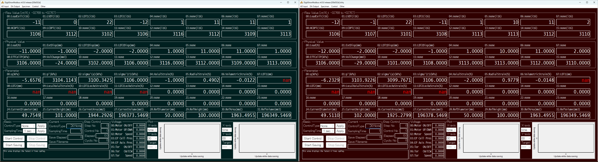

*図: オリジナル版（左）と非オリジナル版（右）の背景色の違い*

## 起動時変数の設定（ユーザー向け）

ここでは、Windowsのショートカットのプロパティを利用した起動時変数の設定について、特に一般ユーザー向けのものに絞って説明します。
すべての起動時変数については、[デベロッパーマニュアルの「起動時変数」節](developer_manual.md#起動時変数)を参照してください。

起動時変数を設定するには、実行ファイル（DigitShowModbus.exe）のショートカットを作成し、ショートカットのプロパティを開いてください。
**Target**で、実行ファイルのパスの後に、半角スペースを開けてから、以下に示す各種の起動時変数の指定を行ってください。図の例では`-p=COM3`でCOMポートを指定しています。

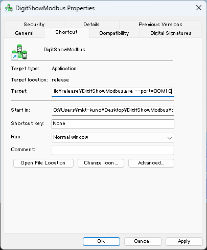

*図: ショートカットのプロパティを利用した起動時変数の設定例。*

### ModbusRTU COM Port

完全表記が`--port=`、短縮表記が`-p=`です。

ModbusRTUボードとの通信に使用するCOMポートを指定するための引数です。
`--port=COM10`や`-p=COM6`のように指定します。
ModbusRTUボードのうち、Trio（v1）・Quartet（v2）では、製造時期や互換ボードかどうかによって、FT232やCH340など、何かしらのUSBシリアル変換ICを使用しているため、デバイスマネージャー等で確認しましょう。
また、動作際してはドライバが必要になります。
ArduinoIDEをインストールするか、多くの場合WindowsUpdateのAdditional Updateでドライバがインストール可能です。
Yamanin（v3）では、USB-CDC（ACM）を使用した高速・高信頼のシリアル通信を採用しており、基本的にWindows標準のドライバが利用可能なため、追加のドライバインストールは不要です。

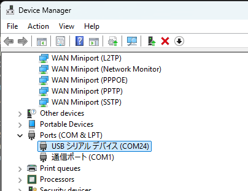

*図: COMポートの例*

### 動作モード

完全表記が`--mode=`、短縮表記が`-m=`です。

“0”もしくは“motor”を指定することで生研式モータ動作モードで起動します。

“1”もしくは“torsional”を指定することで生研式ねじり試験動作モードで起動します。

基本的にMotor動作モードで起動することをお勧めします。ねじりモードは開発中です。
Debugビルドで試用して、安全性を確認してから長期運用してください。

### クラッチ&モータ動作電圧

完全表記が`--invert_motor_enable=`、短縮表記が`-ime=`です。

完全表記が`--invert_motor_direction=`、短縮表記が`-imd=`です。

“True”もしくは“true”、“1”を指定することで極性が反転します。
デフォルト状態はソースコードの確認をしてください。大きな変更が加わっていない限りは、
“モータON”が“$5.0\,\mathrm{[V]}$”、“モータOFF”が“$0.0\,\mathrm{[V]}$”。
同じように“モータUP”が“$5.0\,\mathrm{[V]}$”、“モータDOWN”が“$0.0\,\mathrm{[V]}$”です。
コードを検索する場合は下記のような記述を探してください。

**CDigitShowModbus.cpp より抜粋**

```cpp
#define DSM_AO_DEF_VLT_MOTOR_ON (5.0f)			// Voltage of Axial Motor ON
#define DSM_AO_DEF_VLT_MOTOR_OFF (0.0f)			// Voltage of Axial Motor OFF
#define DSM_AO_DEF_VLT_MOTOR_UP (5.0f)			// Voltage of Axial Motor UP
#define DSM_AO_DEF_VLT_MOTOR_DOWN (0.0f)		// Voltage of Axial Motor DOWN
```

### Webサーバー機能

完全表記が`--listen=`、短縮表記が`-l=`です。
地下実験室にいなくても、同一ネットワーク内であれば、研究室のパソコンからモニタリングが可能になります。
同一PCでたくさんチャートを見たいだけなら`--listen="localhost:80"`を、
実験室の他のパソコンからも見たいなら`--listen="0.0.0.0:80"`を設定してください。
`https://github.com/mkt-kuno/DigitShowWebview/`のRelease版をダウンロードして、
実行中の`DigitShowModbus.exe`と同じフォルダに置くと、簡単にリモートモニタリングが可能です。
複雑な表示がしたい人は自分でコーディングしてください。
フォルダ構成は以下のようになります。

**Webサーバー機能有効時のフォルダ構成例**

```
DigitShowModbus.exe
modbus-5.dll
www/
├── index.html
├── ~~~~~.css
└── ~~~~~.js
```

## センサーと入力チャンネル構成

ここでは標準的なセンサーと入力チャンネルの構成について説明します。
DigitShow Modbusでは、独自開発したModbusボードと通信を行い、センサーからアナログ信号を受け取ります。
CH0-7までがひずみゲージ式のセンサーの信号の受け取りに、CH8-15が0-5Vの直流電圧信号の受け取りに、それぞれ対応しています。
なお、センサーのキャリブレーション方法については、[クイックスタート](quickstart.md#供試体を設置する前ロードセルのキャリブレーション値の入力)を参照してください。

### CH0:ロードセル

ロードセルは、供試体にかかる鉛直荷重を計測するためのセンサーです。4ゲージ（フルブリッジ）式で、セル室内のキャップ上部に取り付けられることが想定されます。

### CH1:LVDT（外部変位計）

外部変位計は、供試体の鉛直変位を計測するためのセンサーです。4ゲージ（フルブリッジ）式で、セル室の外などに取付られることが想定されています。

### （任意）CH2,3:LDT（局所変位計）

LDTはLocal Displacement Transducerの略で、Goto et al. (1991)によって開発された供試体の局所軸ひずみを計測するためのセンサーです。供試体側面上の2点問の軸圧縮量から局所軸ひずみを求めます。ベディングエラー（「外部変位計などによってキャップや載荷ピストンの軸変位から求めた軸ひずみ」に含まれる測定誤差）の無い正確な軸ひずみを求めることができます。計測できる最大ひずみは$1\,\%$程度ですが、微小なひずみを正確に計測することができます。供試体の直径方向に対称に1組設置し、2つのLDTで計測された値の平均値を用います。なお、LDTの設置は任意であり、使用しなくてもプログラムの動作に影響はありません。

### CH4-7:空きチャンネル

ひずみゲージ式の各種センサーを接続することができる空きチャンネルです。

### CH8:HCDPT（高容量差圧計）

供試体の半径方向の有効応力を計測するためのセンサーです。セル水の圧力と供試体の間隙水圧の差圧を測ります。差圧に応じた4-20mVのDC信号を伝送する差圧伝送器および、DC信号を直流電圧信号に変換するディストリビューターを使用することが想定されます。

### CH9:LCDPT（低容量差圧計）

供試体の排水量を計測するためのセンサーです。排水量に応じて、供試体に繋がるビュレットの水位が変動するため、ビュレットの基準水位との水位差を差圧として計測します。HCDPTと同じく差圧伝送器とディストリビューターを使用することが想定されます。

### CH10-15:空きチャンネル

直流電圧で入力される各種センサーを接続することができる空きチャンネルです。

## 出力チャンネル構成

DigitShow Modbusでは、独自開発したModbusボードと通信を行い、6チャンネルまたは8チャンネルの0-10Vのアナログ出力を使用することができます。
ここではアナログ出力チャンネルの構成について説明します。

### CH0:モーターON/OFF

鉛直載荷モーターのクラッチのON/OFFを切り替えるための出力チャンネルです。デフォルトで、OFFのときは0V、ONのときは5Vが出力されます。[起動時変数の設定（ユーザー向け）](#起動時変数の設定ユーザー向け)節に示す起動時変数の設定でON/OFF電圧の極性を反転させることができます。

### CH1:モーターUP/DOWN

鉛直載荷モーターのUP/DOWNを切り替えるための出力チャンネルです。デフォルトで、UPのときは5V、DOWNのときは0Vが出力されます。[起動時変数の設定（ユーザー向け）](#起動時変数の設定ユーザー向け)節に示す起動時変数の設定でUP/DOWNの極性を変更することができます。試験機により極性を反転させる必要があるので注意してください。

### CH2:モーター速度

鉛直載荷モーターの回転速度（RPM）を設定するための出力チャンネルです。多くの生研式三軸試験機では、300RPM/Vとなっています。

### CH3:セルEP圧力

EPは電空レギュレータ(Electrical-Pneumatic converter)の略称で、電圧に応じた空圧を出力する装置で、セル圧の制御に使用されます。デフォルトでは、0.01275kPa/Vの設定となっています。

### CH4-7:空きチャンネル

生研式モータ動作モードでは、空きチャンネルとなります。

## 供試体寸法・ひずみ・応力の計算式

ここでは、DigitShow Modbusで計算される供試体寸法・ひずみ・応力の計算式について説明します。

### 供試体寸法

供試体寸法には、時々刻々と変化する現在の寸法のほかに、レファレンス値という概念が存在します。現在の寸法は、「どこからどのくらい増えた／減ったのか」を計算することによって得られますが、レファレンス値とは、この「どこから」の情報に相当します（「どのくらい増えた／減った」の情報はセンサーから得られます）。また、レファレンス値はひずみの計算の分母に用いられます。レファレンス値は時々刻々の変化はしない定数ですが、値は圧密の前と後で更新されます。

#### 供試体寸法のレファレンス値

試験の最初に、実験者は供試体の初期直径を$d_\mathrm{init}$と初期高さ$h_\mathrm{init}$を測定します。これらをもとに初期体積$V_\mathrm{init}$が次のように計算されます。

$$
\begin{align}
    V_\mathrm{init} = \frac{\pi{d_\mathrm{init}}^2h_\mathrm{init}}{4}
\end{align}
$$

Before Consolidationを押す時点でのLVDTで計測された変位を$\delta_\mathrm{BC}$とします。等方的な変形が生じた（軸ひずみの3倍の体積ひずみが生じた）という仮定のもと、供試体寸法のレファレンス値（圧密前高さ$h_\mathrm{BC}$、圧密前体積$V_\mathrm{BC}$、圧密前直径$d_\mathrm{BC}$）は次のように更新されます。

$$
\begin{align}
    h_\mathrm{BC} &= h_\mathrm{init} - \delta_\mathrm{BC} \\
    V_\mathrm{BC} &= V_\mathrm{init} \left(1 - \frac{3\delta_\mathrm{BC}}{h_\mathrm{init}}\right) \\
    d_\mathrm{BC} &= \sqrt{\frac{4V_\mathrm{BC}}{\pi h_\mathrm{BC}}}
\end{align}
$$

After Consolidationを押す時点でのLVDTで計測された変位を$\delta_\mathrm{AC}$と、LCDPTで計測された排水量を$W_\mathrm{AC}$とします。これらをもとに、圧密後の供試体寸法のレファレンス値（圧密前高さ$h_\mathrm{AC}$、圧密前体積$V_\mathrm{AC}$、圧密前直径$d_\mathrm{AC}$）は次のように更新されます。

$$
\begin{align}
    h_\mathrm{AC} &= h_\mathrm{BC} - \delta_\mathrm{AC} \\
    V_\mathrm{AC} &= V_\mathrm{BC} - W_\mathrm{AC} \\
    d_\mathrm{AC} &= \sqrt{\frac{4V_\mathrm{AC}}{\pi h_\mathrm{AC}}}
\end{align}
$$

#### 供試体の現在の寸法

現在のレファレンスの高さを$h_\mathrm{ref}$、体積を$V_\mathrm{ref}$とします。また、LCDPTで計測された現在の排水量（供試体から出る方向が正）を$W$と、LVDTで計測された鉛直変位（供試体が圧縮する方向が正）を$\delta$とします。このとき、現在の供試体の高さ$h$, 体積$V$と断面積$A$は次のようになります。

$$
\begin{align}
    h &= h_\mathrm{ref} - \delta \\
    V &= V_\mathrm{ref} - W \\
    A &= \frac{V}{h}
\end{align}
$$

### ひずみ

現在の高さを$h$、体積を$V$とし、レファレンス高さを$h_\mathrm{ref}$、体積を$V_\mathrm{ref}$とします。このとき、軸ひずみ$\varepsilon_\mathrm{a}\ \left[\%\right]$, 体積ひずみ$\varepsilon_\mathrm{v}\ \left[\%\right]$, 半径方向ひずみ$\varepsilon_\mathrm{r}\ \left[\%\right]$は次のように計算されます。

$$
\begin{align}
    \varepsilon_\mathrm{a} &= \left(1 - \frac{h}{h_\mathrm{ref}}\right) \times 100 \\
    \varepsilon_\mathrm{v} &= \left(1 - \frac{V}{V_\mathrm{ref}}\right) \times 100 \\
    \varepsilon_\mathrm{r} &= \left(1 - \sqrt{\frac{1-\varepsilon_\mathrm{v}}{1-\varepsilon_\mathrm{a}}}\right) \times 100
\end{align}
$$

なお、昔のプログラム（DigitShowBasic）では、真ひずみが使用されていました。
地盤工学会の基準は公称ひずみを採用していたため、DigitShowModbusではよりシンプルに公称ひずみを採用しました。
ひずみ$10\,\%$くらいまでであれば、両者の差は小さいですが、変形が大きくなるほど、公称ひずみ（現プログラム）と真ひずみ（旧プログラム）の差が大きくなります。既往研究との比較をする際には注意してください。
真ひずみはひずみの足し合わせができることが利点とされるようです。
必要に応じて、事後的に自分で計算してください。

### 応力

ロードセルが計測する荷重を$F$とします。軸差応力$q$は次式で計算されます。

$$
\begin{align}
    q = \frac{F}{A}
\end{align}
$$

HCDPTの計測する値がそのまま半径方向の有効応力${\sigma'}_\mathrm{r}$になります。これらを用いて、軸方向の有効応力${\sigma'}_\mathrm{a}$と平均有効応力$p'$は次のようになります。

$$
\begin{align}
    {\sigma'}_\mathrm{a} &= {\sigma'}_\mathrm{r} + q \\
    p' &= \frac{{\sigma'}_\mathrm{a} + 2{\sigma'}_\mathrm{r}}{3} \\
    &= \frac{q + 3{\sigma'}_\mathrm{r}}{3}
\end{align}
$$

### (LDTを使用した場合のみ)局所鉛直ひずみ

LDT(Local Displacement Transducer)を使用した場合、鉛直方向の局所ひずみを計算することができます。LDTのレファレンス長さを$LDT_\mathrm{ref}$、LDTで計測された局所変位を$\delta_\mathrm{LDT}$とします。このとき、現在のLDTの長さ$LDT$と局所鉛直ひずみ$\varepsilon_\mathrm{LDT}$は次のように計算されます。

$$
\begin{align}
    LDT &= LDT_\mathrm{ref} - \delta_\mathrm{LDT} \\
    \varepsilon_\mathrm{LDT} &= \left(1 - \frac{LDT}{LDT_\mathrm{ref}}\right) \times 100
\end{align}
$$

なお、LDTは、供試体のひねり状態の補正するために、供試体の直径方向に対象に1組設置し、2つのLDTで計測された$\varepsilon_\mathrm{LDT}$の平均値を用いることが推奨されます。

## 各ウインドウの説明

ソフトウェアの各ウインドウについて説明します。

### MainWindow

起動時に表示されるメインウインドウの各部分の説明をします。

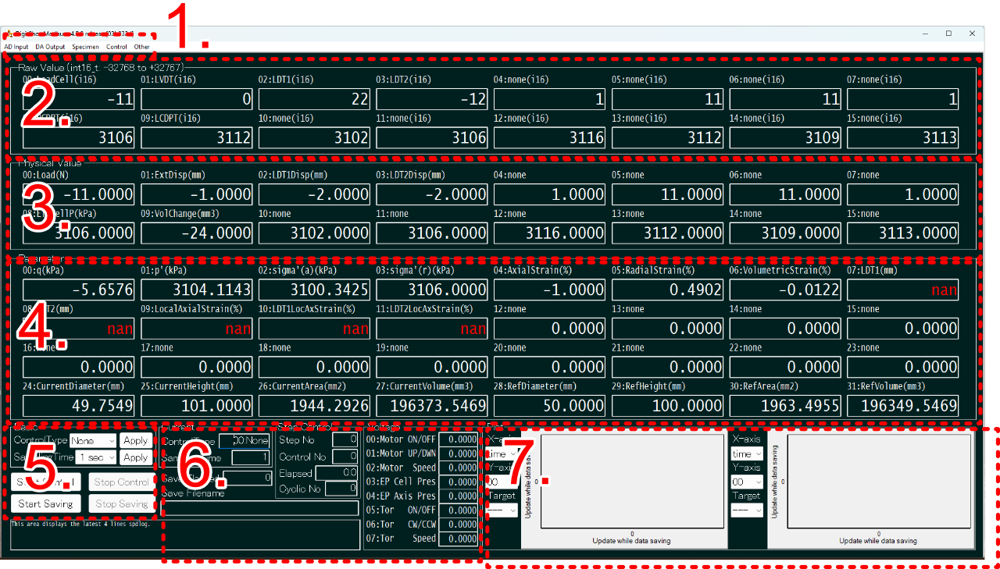

*図: メイン画面。*

1. メイン画面の左上にあるタブから、キャリブレーションや供試体の情報、コントロール設定などに関する各ウィンドウ（次項以降で詳述）を開くことができます。
2. Raw Valueでは、センサーからAD変換されたデジタル信号の生データを表示します。最小値は-32768、最大値は32767のint16型の値が表示されます。
3. Physical Valueでは、Raw Valueをキャリブレーション値を用いて物理量($\mathrm{N}$や$\mathrm{mm}$など)に変換した値を表示します。
4. Parametersでは、応力ひずみや、供試体の現在の寸法、レファレンス寸法などが表示されます。これらの値は、Physical Valueや供試体寸法の情報をもとに計算された値です。
5. Voltage Outでは、[出力チャンネル構成](#出力チャンネル構成)節に示すアナログ電圧出力値の情報が表示されます。
6. Plotでは、Raw ValueやPhysical Value、Parametersの値の変化をグラフで表示します。データ保存中は最大512点まで表示されます。保存していないときは、最新60秒のデータが表示されます。
7. System Log & Control Info では、システム全体のエラーや警告ログ、現状のControl情報や、次のステップの情報などを閲覧できます。
8. Current Settings & Basic Settingsでは、Control Typeや、Samplingレートの設定や、制御とサンプリングの開始・停止を行うことができます。なお、Control TypeやSamplingレートの設定は、Setボタンを押すことで反映されます。

### DA Output - Voltage Output

アナログ出力について、直接電圧を指定して出力できるウインドウです。
EPを三軸セルに接続する前に、EPの出力圧力を調整する際に使用します。
また、装置を組み上げたり接続し直した場合に、クラッチやモータなどの動作確認などにも使用されます。

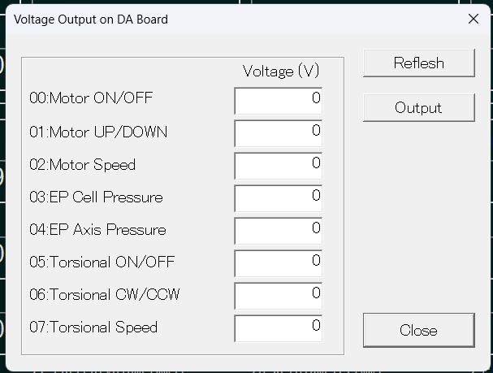

*図: DA Output - Voltage Outputウィンドウ。*

### Specimen - Config

供試体の初期寸法を設定するウインドウです。供試体の直径と高さ・LDTの長さなどを入力します。

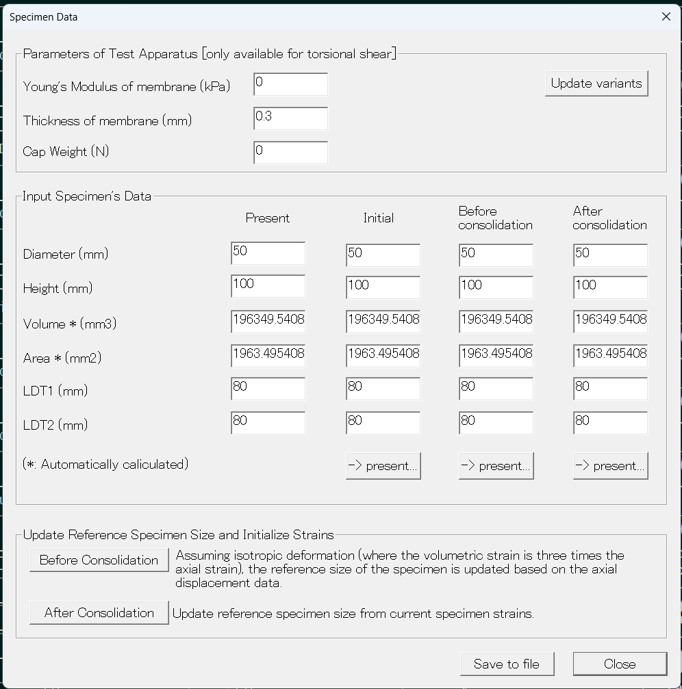

*図: Specimen - Configウィンドウ。*

TBD...

### Control - Pre-Consolidation

Pre-Consolidationは先行圧密用の制御コマンドです。主に供試体の飽和過程で使用します。
制御の詳細については、[コントロールについて](#コントロールについて)を参照してください。

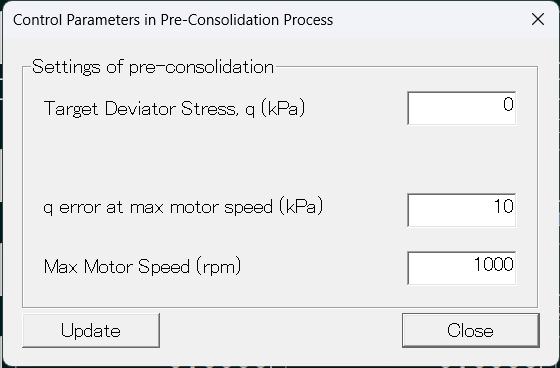

*図: Control - Pre-Consolidationウィンドウ。*

### Control - Control from file

複数のコントロールを順序立てて自動的に行うための設定を行うウインドウです。圧密・クリープ・モーター速度・圧縮方向などの設定を入力します。

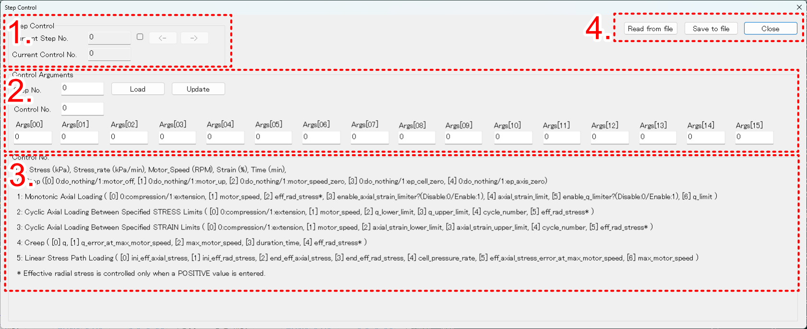

*図: Control - Control from fileウィンドウ。*

1. 現在のControlのStep No.が表示されます。チェックボックスを選択した上で、矢印ボタンをクリックするとStep No.のインクリメント・デクリメントができます。なお、設定可能なStep No.は0から1023までです。
2. 各StepのControl No.の設定およびそのパラメータの設定を行うことができます。Loadボタンをクリックすると、現在入力中のStep No.の、DigitShowModbusに設定されているControl No.とパラメータが表示されます。Updateボタンをクリックすると、現在入力されているStep No.のControl No.とパラメータが、DigitShowModbus内に登録されます。
3. 各Control No.の詳細が記述されています。なお、Control No.の詳細は、[コントロールについて](#コントロールについて)を参照してください。
4. Read from fileボタンをクリックすると、指定したファイルからStep No., Control No.とパラメータを読み込むことができます。Save to fileボタンをクリックすると、現在設定されているStep No., Control No.とパラメータの情報を、指定したファイルに保存することができます。Closeボタンを押すと、ウインドウが閉じます。

制御の詳細については、[コントロールについて](#コントロールについて)を参照してください。

### Other - Version

ソフトウェアのバージョン情報を表示するウインドウです。

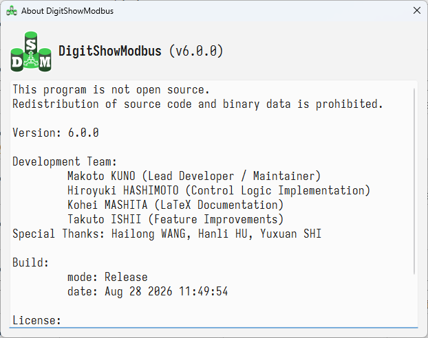

*図: Other - Versionウィンドウ。*

### Other - Environmental Variables

ソフトウェアの環境変数を表示するウインドウです。
コントロール中やデータ保存中に、環境変数を確認したい場合は注意してください。

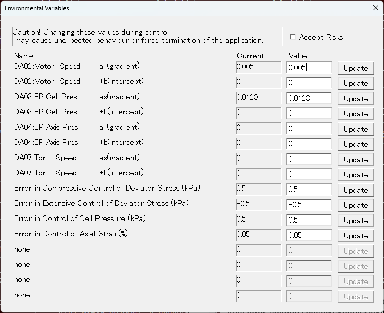

*図: Other - Environmental Variablesウィンドウ。*

### Other - Open Log Folder

ソフトウェアのログを表示するウインドウです。エラーが発生した場合などに参照します。

### Other - Open Config Folder

ソフトウェアのが自動で生成する設定ファイルを表示するウインドウです。

## コントロールについて

ここでは、DigitShowModbusの各コントロール機能について説明します。
大きく分けて、供試体の飽和過程で使用するPre-Consolidation (Control ID:1)と、圧密や軸圧縮時に使用するControl from file (Control ID:15)の2つに分かれます。

### Pre-Consolidation

Pre-Consolidationは、供試体の飽和過程で使用するコントロールです。
[以下の図](#pre-consolidation)に示すように、設定した軸差応力を保つように載荷軸を上下させます。
デフォルトの設定では、$q=0\,\mathrm{kPa}$なので、等方状態を保とうとします。

軸差応力が目標値から離れれば離れるほど、高速でモーターを回転させて載荷軸を上下させます（いわゆるP制御のようなもの）。
ただし、クラッチの消耗を防ぐため、軸差応力が$0.5\,\mathrm{kPa}$以下しか離れていないのであれば、載荷軸は動かないようにプログラムされています（この閾値はユーザーからは設定できません）。

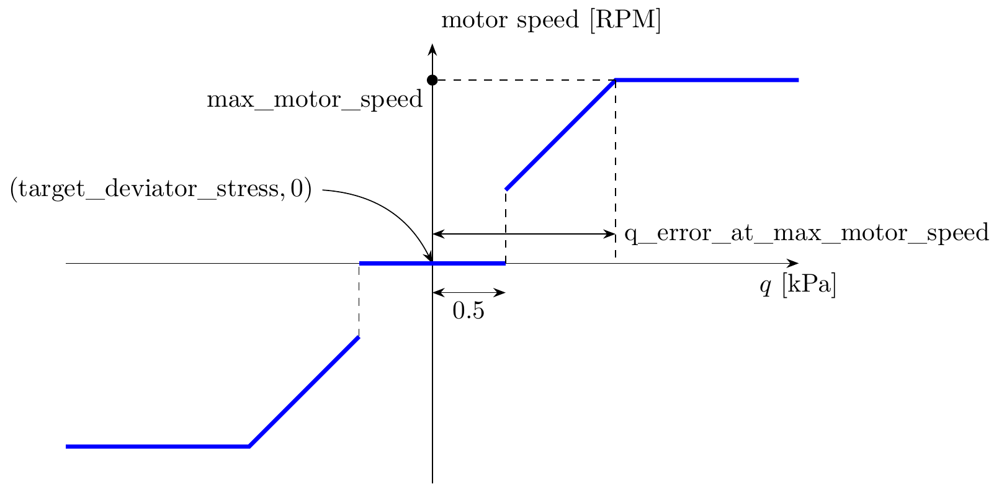

*図: Pre-Consolidationの動作のイメージ*

### Control from file - 0: Stop

Control No.0: Stopは、引数で指定しない限り、基本的に何の制御も行いません。
モーターのクラッチはONのまま、モーターは回転しません（載荷軸は全く動きません）。
セル圧を制御するEPの出力電圧は、それまでの値を保持します（セル圧も基本的に変動しません）。

v4.6.xまでは「No control」でしたが、v4.7.0からは「Stop」に名称を変更しました。
互換性を保つため、引数で指定しない場合は、従来の「No control」と同様に、基本的に何の制御も行いません。

以下のパラメータが設定できます。

- Args[00]: Motor クラッチOFF設定。0は何もしない、1はモータークラッチOFF
- Args[01]: Motor 回転方向設定。0は何もしない、1はモーターUP
- Args[02]: Motor 速度設定。0は何もしない、1は回転速度をゼロ
- Args[03]: EP Cell Pressure設定。0は何もしない、1はEPの出力電圧を0[V]
- Args[04]: EP Axial Pressure設定。0は何もしない、1はEPの出力電圧を0[V]

### Control from file - 1: Monotonic Axial Loading

Control No.1: Monotonic Axial Loadingは、単調軸圧縮・軸伸長を行うコントロールです。

以下のパラメータが設定できます。

- Args[00]: 圧縮（compression）か伸長（extension）か。0が圧縮、1が伸長です。
- Args[01]: モーターの回転速度。単位はRPM。RPMと実際の載荷速度の関係は試験機および減速機の設定などによって異なるため、予め確認しておく必要があります。
- Args[02]: 半径方向の有効応力。単位はkPa。正の値が入力されたときのみ、EPでセル圧を制御することで、円周方向の有効応力を設定された値に保ちます（0以下の値が入力された場合、EPの出力圧力は変化しません）。逆に、非排水三軸試験を行う場合には、必ず0を入力してください。
- Args[03]: 軸ひずみのリミッター設定を行うか否か。1で有効化、0で無効化。リミッターを有効化した場合、Args[04]で設定された値を超えるひずみが計測された場合に次のStep No.に進みます。
- Args[04]: 軸ひずみのリミッター値。単位は%。Args[03]でリミッターを有効化した場合に、Args[04]で設定された値を超えるひずみが計測された場合に次のStep No.に進みます。
- Args[05]: 軸差応力のリミッター設定を行うか否か。1で有効化、0で無効化。リミッターを有効化した場合、Args[06]で設定された値を超える軸差応力が計測された場合に次のStep No.に進みます。
- Args[06]: 軸差応力のリミッター値。単位はkPa。Args[05]でリミッターを有効化した場合に、Args[06]で設定された値を超える軸差応力が計測された場合に次のStep No.に進みます。

なお、Args[03]とArgs[05]のリミッターは少なくとも1つは設定する必要があります。両方とも設定しない場合、載荷が行われません。
また、非排水三軸圧縮試験の場合には、Args[04]にロードセルの定格容量を設定することをお勧めします（応力経路で限界状態線上に達したのちに軸差応力が増加し続ける場合があるためです）。

### Control from file - 2: Cyclic Axial Loading Between Specified STRESS Limits

Control No.2: Cyclic Axial Loading Between Specified STRESS Limitsは、指定した応力範囲での繰り返し軸載荷を行うコントロールです。

以下のパラメータが設定できます。

- Args[00]: 圧縮(compression)か伸長(extension)か。0が圧縮、1が伸長です。
- Args[01]: モーターの回転速度。単位はRPM。RPMと実際の載荷速度の関係は試験機および減速機の設定などによって異なるため、予め確認しておく必要があります。
- Args[02]: 軸差応力の下限値。単位はkPa。
- Args[03]: 軸差応力の上限値。単位はkPa。
- Args[04]: 何サイクル載荷を行うか。所定のサイクル数の載荷を終えた場合、次のStep No.に進みます。
- Args[05]: 半径方向の有効応力。単位はkPa。正の値が入力されたときのみ、EPでセル圧を制御することで、円周方向の有効応力を設定された値に保ちます（0以下の値が入力された場合、EPの出力圧力は変化しません）。逆に、非排水三軸試験を行う場合には、必ず0を入力してください。

### Control from file - 3: Cyclic Axial Loading Between Specified STRAIN Limits

Control No.3: Cyclic Axial Loading Between Specified STRAIN Limitsは、指定した軸ひずみの範囲での繰り返し軸載荷を行うコントロールです。以下のパラメータが設定できます。

- Args[00]: 圧縮(compression)か伸長(extension)か。0が圧縮、1が伸長です。
- Args[01]: モーターの回転速度。単位はRPM。RPMと実際の載荷速度の関係は試験機および減速機の設定などによって異なるため、予め確認しておく必要があります。
- Args[02]: 軸ひずみの下限値。単位は%。
- Args[03]: 軸ひずみの上限値。単位は%。
- Args[04]: 何サイクル載荷を行うか。所定のサイクル数の載荷を終えた場合、次のStep No.に進みます。
- Args[05]: 半径方向の有効応力。単位はkPa。正の値が入力されたときのみ、EPでセル圧を制御することで、円周方向の有効応力を設定された値に保ちます（0以下の値が入力された場合、EPの出力圧力は変化しません）。逆に、非排水三軸試験を行う場合には、必ず0を入力してください。

### Control from file - 4: Creep

Control No.4: Creepは、クリープを行うコントロールです。
主に、Control No.5: Linear Stress Path Loadingを用いて圧密した後に、二次圧密を完了させるために使用されます。

以下のパラメータが設定できます。

- Args[00]: ターゲットとなる軸差応力。単位はkPa。
- Args[01]: 軸差応力が現在の値とどれだけズレたときに、Args[02]で設定したモーターの回転速度となるか。単位はkPa。
- Args[02]: モーターの最大回転速度。単位はRPM。
- Args[03]: 継続時間。単位は分。指定した時間が経過した場合、次のStep No.に進みます。
- Args[04]: 半径方向の有効応力。単位はkPa。正の値が入力されたときのみ、EPでセル圧を制御することで、円周方向の有効応力を設定された値に保ちます（0以下の値が入力された場合、EPの出力圧力は変化しません）。逆に、非排水条件の場合には、0を入力してください。

実際の運用では、Args[03]には、十分長い時間を設定しておくことが多いです。これは、圧密→クリープ（二次圧密）の後、軸圧縮に進む前に、供試体のレファレンス値の更新とひずみの初期化の操作を手動で行う必要があるため、勝手に次のStep No.に進まないようにするためです。

また、Args[01]とArgs[02]は比例制御に関連するパラメータです。
軸差応力のエラー値（目標値と現在の値の差）とモーターの回転方向・速度の関係については、[Pre-Consolidation](#pre-consolidation)を参照してください。

### Control from file - 5: Linear Stress Path Loading

Control No.5: Linear Stress Path Loadingは、指定した応力経路に沿った載荷を行う始点となる応力状態と、終点となる応力状態を指定することで、応力経路上でその2点を結ぶ直線に沿った載荷を行うコントロールです。
一般に圧密時に使用されます。

以下のパラメータが設定できます。

- Args[00]: 初期の軸（鉛直）方向の有効応力。単位はkPa。
- Args[01]: 初期の半径（水平）方向の有効応力。単位はkPa。
- Args[02]: 最終的に目標とする軸（鉛直）方向の有効応力。単位はkPa。
- Args[03]: 最終的に目標とする半径（水平）方向の有効応力。単位はkPa。
- Args[04]: セル圧を変化させる速度。単位はkPa/min。Args[01]からArgs[03]に向かって、指定した速度でセル圧が増加または減少します。
- Args[05]: 軸方向の有効応力が現在の目標値とどれだけズレたときに、Args[06]で設定したモーターの回転速度となるか。単位はkPa。
- Args[06]: モーターの最大回転速度。単位はRPM。

なお、Args[05]とArgs[06]は比例制御に関連するパラメータです。
有効応力のエラー値（現在の目標値と現在の実際の値の差）とモーターの回転方向・速度の関係については、[Pre-Consolidation](#pre-consolidation)を参照してください。
